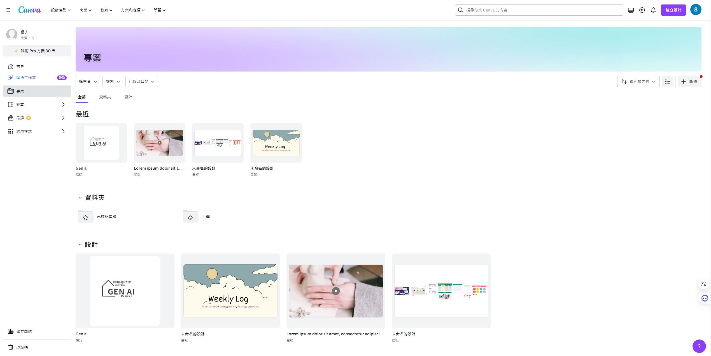
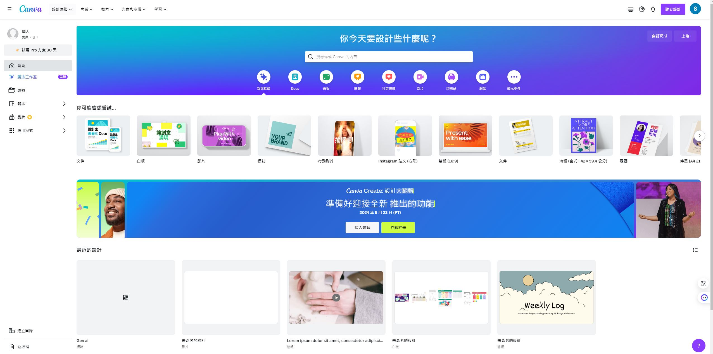
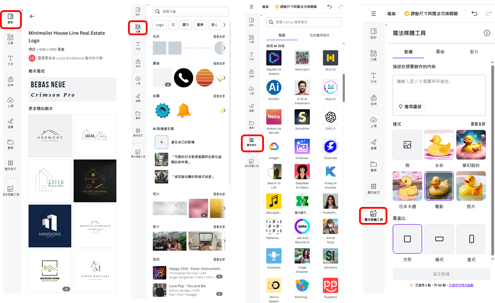
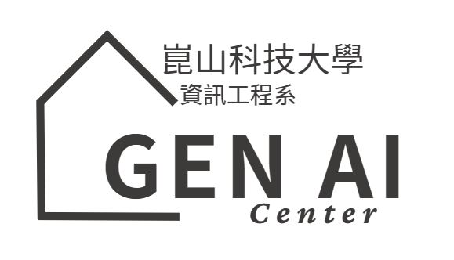
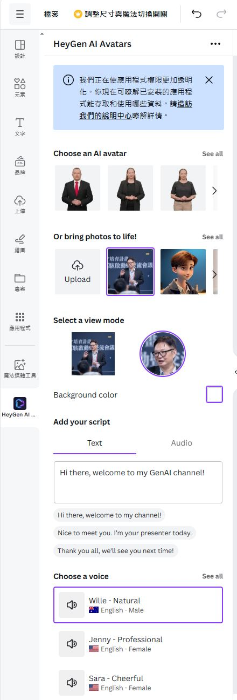
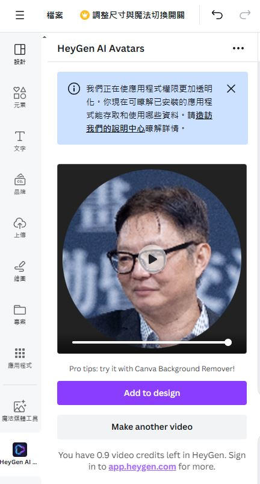

## AIGC實戰教學:Canva實戰

- 我的LOGO
- 我的公仔
- 文字 == >語音(AiVOOV)

# Canva介面與工具

# LOGO設計
- 免費LOGO設計
  - [Adobe Express](https://www.adobe.com/tw/express/create/logo)
  - [fotor](https://www.fotor.com/tw/design/logo/)
  - [designevo](https://www.designevo.com/tw/)

# 使用HeyGen + 圖片 產生 短影音 ==> 只支援英文

<video id="video" controls="" preload="none" poster="封面">
      <source id="mp4" src="https://github.com/8wingflying/GenAI20240518/blob/main/AIGC/MyGenAI.mp4" type="video/mp4">
</videos>
