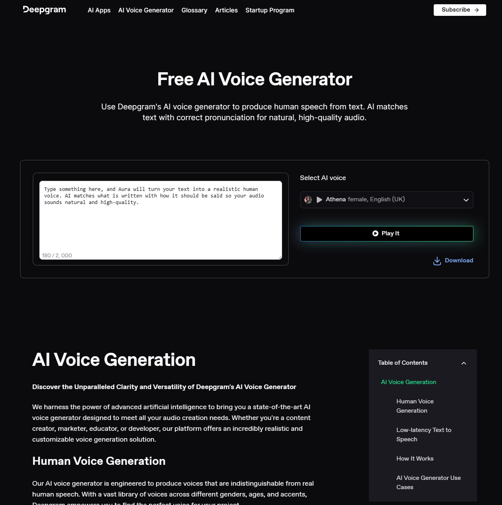
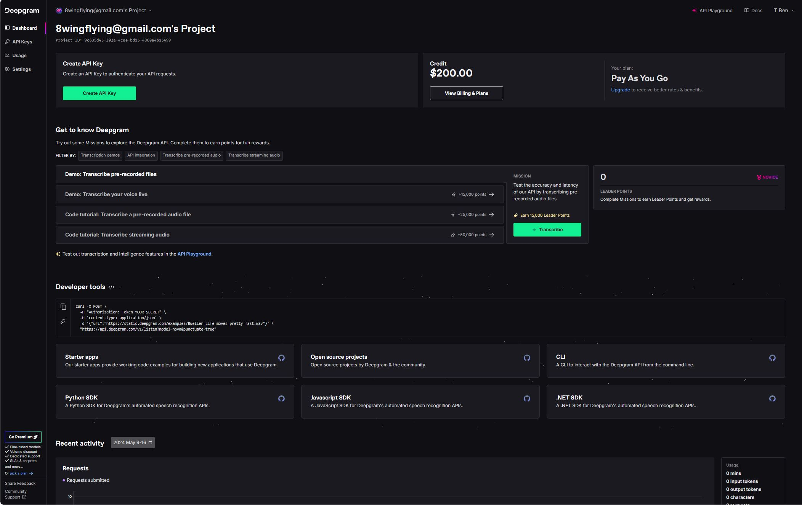
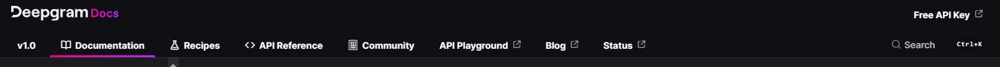
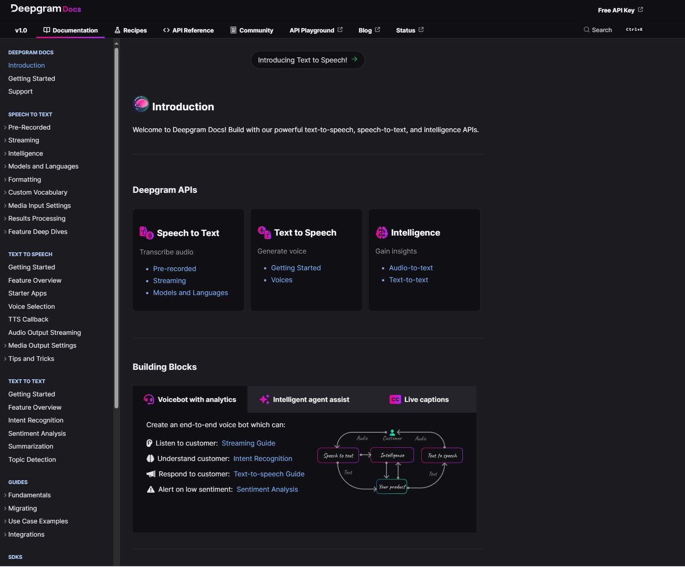
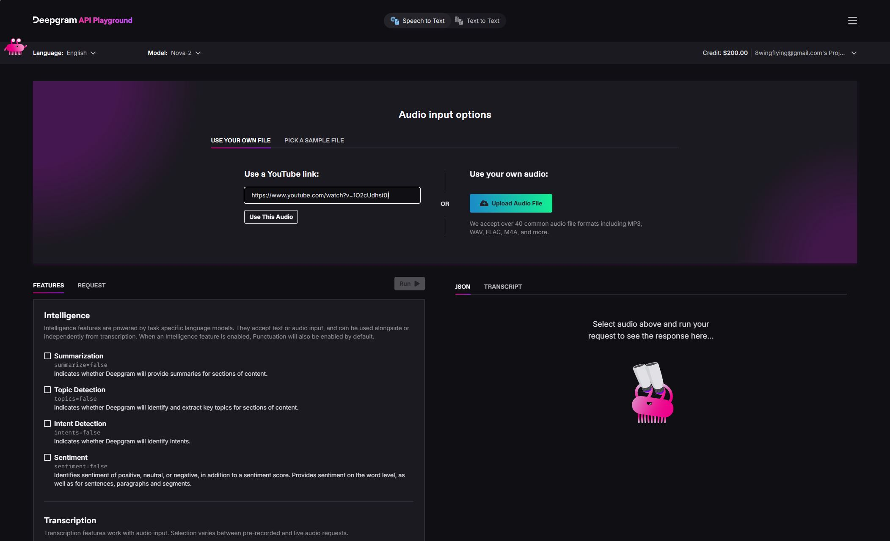
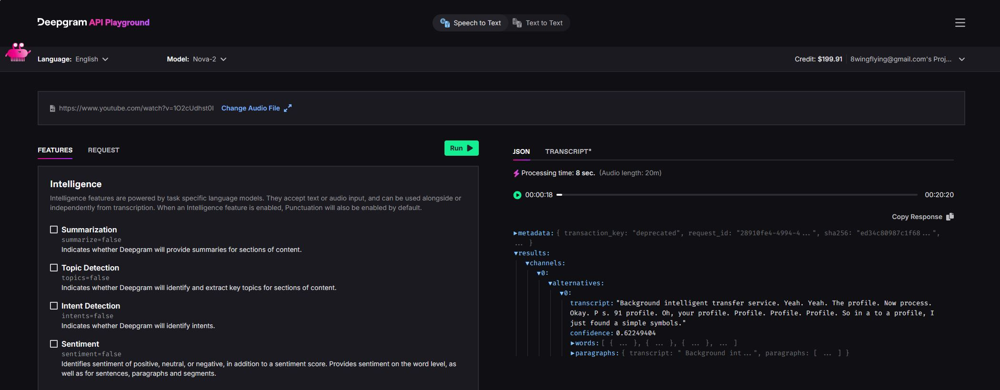
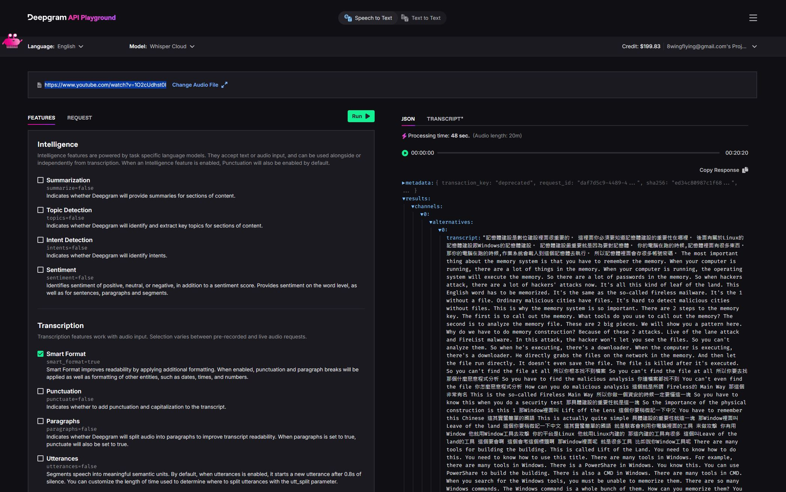

# Deepgram
- `提示詞`:Deepgram 平台有哪些特色?
- `Copilot 回覆`:
```
Deepgram平台是一個強大的語音識別和理解服務，提供了多種功能，包括：

語音轉文字：能夠將語音即時轉換為文字，支持預錄和即時串流的音頻轉寫1。
文本智能：具備情感分析、意圖識別、主題檢測和摘要生成等功能，這些功能目前僅支持英語2。
高準確率：Deepgram擁有行業領先的準確率，使其成為最可靠的語音轉文字API之一3。
低延遲串流轉寫：提供低延遲的串流轉寫服務，並能處理長音頻文件，創建預錄音頻內容的字幕速度比其他選項快達20倍4。
語言AI模型：能夠創建準確的摘要，並識別講話者的情感、主題和意圖，以促進衍生內容的創建和分析4。

這些特色使Deepgram成為開發者在進行語音轉寫和理解時的強大工具。
如果您需要更多關於Deepgram的詳細信息或如何使用它的指南，
我建議訪問它們的官方文檔或網站。

1.developers.deepgram.com
2.developers.deepgram.com
3.aiparabellum.com
4.deepgram.com
5.g2.com
```


## Deepgram 實戰 [登入官網開始玩樂](https://deepgram.com/ai-voice-generator)



## Deepgram 實戰(使用Google帳號登入)




## Deepgram 實戰 [開發者文件由此去](https://developers.deepgram.com/docs/introduction)






- 點選 API Playground 來去玩玩看
- [龍大大的上課錄音](https://www.youtube.com/watch?v=1O2cUdhst0I)






