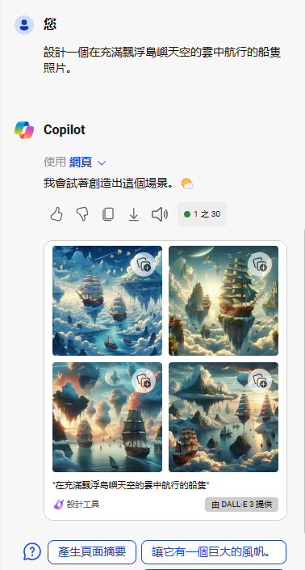

## AIGC | Artificial Intelligence Generated Content | 人工智慧產生內容 
- AI 繪圖生成
  - [Microsoft Copolit|Designer(Bing Image creater)](Designer.md)
  - [Playground AI - free-to-use online AI image creator](https://playground.com/)
  - Ideogram
  - [Canva實戰](Canva_lab.md)
  - [Stable Diffusion實戰](SD_lab.md)
  - [Midjourney實戰(需要付費)](Midjourney_lab.md)
    - [Lp Old Covers Masters](https://promptbase.com/prompt/lp-old-covers-masters)
    - [Best Midjourney Avatar Prompts](https://promptbase.com/midjourney-avatars) 
  - [Leonardo.ai](Leonardo_ai.md)
  - [Tensor.Art | FREE online image generator and model hosting site!](Tensor_art.md)
    - Tensor Art 是一款網頁版的 AI 繪圖工具，可讓使用者透過使用各種模型、調整設定以及利用 LoRA、細節工具、影像提示、長寬比和種子一致性等功能來創建個人化的藝術作品
  - Disco Diffusion
  - lexica
    - [官方網址](https://lexica.art/)
  - https://arthub.ai/
  - Pencil Sketch a Phot
    - [Pencil Sketch a Photo](https://sketchmypic.com/)
    - [Sketch My Pic 線上將圖片轉為鉛筆畫](https://chtouch.com/3370/#:~:text=%E5%A6%82%E4%BD%95%E4%BD%BF%E7%94%A8%20Sketch%20My%20Pic%20-Pencil%20Sketch%20a%20Photo,Apply%20Pencil%20Sketch%20Effect%20%5D%EF%BC%8C%E4%BE%BF%E6%9C%83%E4%B8%8A%E5%82%B3%E8%88%87%E8%BD%89%E6%8F%9B%E3%80%82%203%203.%20%E8%BD%89%E5%87%BA%E7%9A%84%E7%89%88%E6%9C%AC%EF%BC%8C%E7%94%A8%E6%88%B6%E5%8F%AF%E6%93%87%E4%B8%80%E6%88%96%E5%85%A8%E9%83%A8%E9%83%BD%E4%B8%8B%E8%BC%89%E3%80%82)
  - Fotoram
    - [Fotoramio 免費線上圖片編輯、拼貼、藝術特效工具，輕鬆打造精彩圖像](https://chtouch.com/fotoramio/)
- AI 音樂生成
  - Google musicLM
  - Suno
- AI 影音生成
  - OpenAI SORA
  - D-ID
  - Runway
  - Pika.art 免費的線上AI影片+3D動畫產生器
- [AI_PPT生成 GAMMA](GAMMA.md)
- AI搜尋引擎
  - Perplexity
## 更多工具 [AIGC_Tools]()
- [PNGTree](https://zh.pngtree.com/)

# AIGC 常用主題

## 文字 == > 圖片

## 圖片 == > 圖片
- https://fotoram.io/artstyle/en

## 刪除圖像背景  
- https://stablediffusionweb.com/zh-tw/background-remover

