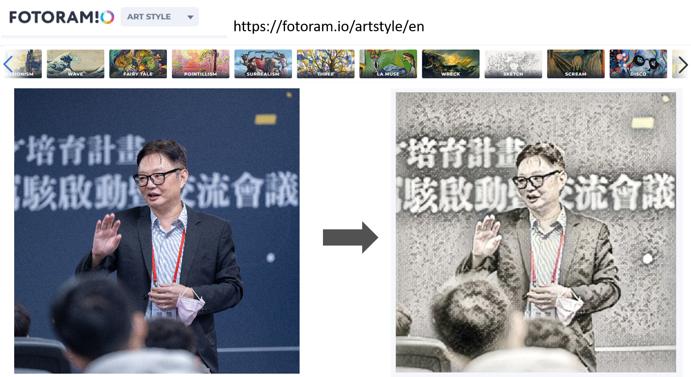
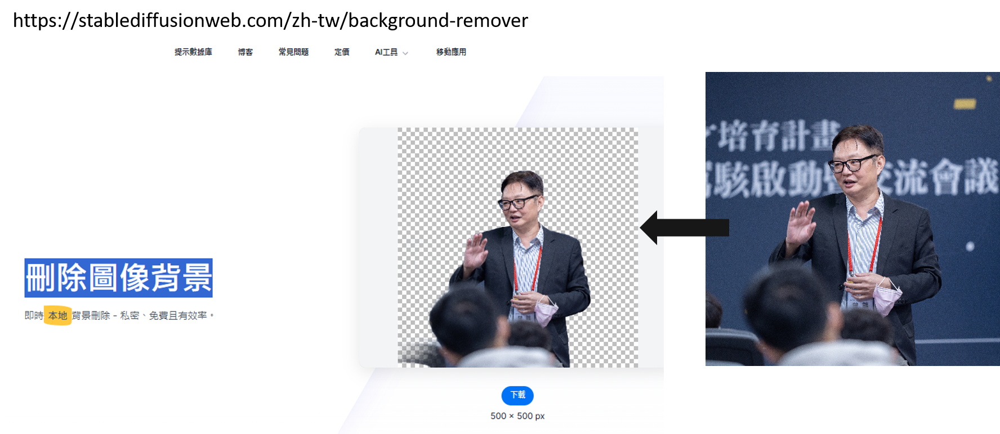

## AIGC | Artificial Intelligence Generated Content | 人工智慧產生內容 
- AIGC實戰教學:[Canva實戰](Canva_lab.md)
  - 我的LOGO
  - 我的公仔
  - 文字 == >語音(AiVOOV)
- AIGC實戰教學:[Stable Diffusion實戰](SD_lab.md)
  - 文字 == > 圖片
  - 圖片 == > 圖片
- AIGC實戰教學:[Midjourney實戰(需要付費)](Midjourney_lab.md)
- AIGC實戰教學:[Leonardo.ai](Leonardo_ai.md)
- AIGC實戰教學:[TensoRART]
- AIGC實戰教學:[AI_PPT生成 GAMMA](GAMMA.md)

## 文字 == > 圖片

## 圖片 == > 圖片
- https://fotoram.io/artstyle/en

## 刪除圖像背景  
- https://stablediffusionweb.com/zh-tw/background-remover

