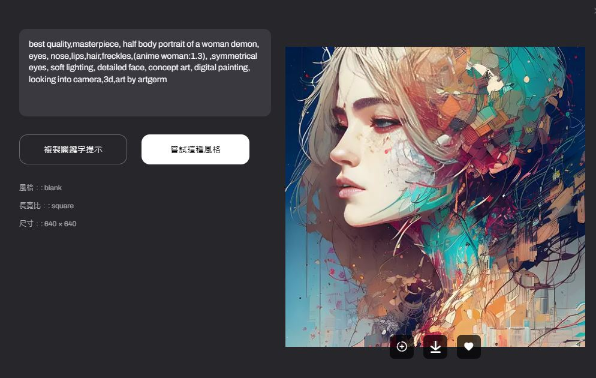
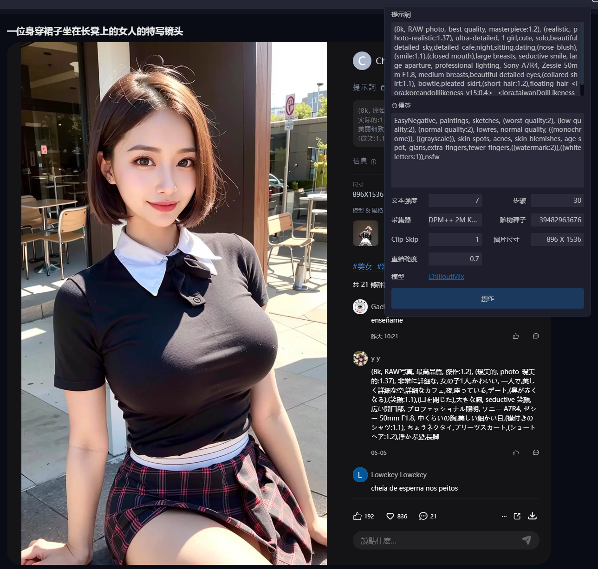

# AI_Image_Generation
- Text-TO-Image
- Image-To-Image
- Image-To-3D
- Image-To-Gif
## 系統與平台
- OpenAI DALL‧E
- Midjourney AI
- [Stable Diffusion](StableDiffusion.md)
- Stable Diffusion WebUi Forge
- ComfyUI
- Adobe Firefly
- Stable Zero123
- AnyDoor
- [Artguru AI 繪圖生成器：線上一鍵生成AI 圖片](https://www.artguru.ai/tw/)
- [免費 AI 藝術創作 - SeaArt AI](https://www.seaart.ai/zhTW)
- [Lensa](https://prisma-ai.com/lensa)
  - [Lensa實戰](Lensa_labs.md) 
# 範例:Artguru AI
```
best quality,masterpiece, half body portrait of a woman demon, eyes, nose,lips,hair,freckles,
(anime woman:1.3), ,symmetrical eyes, soft lighting, detailed face, concept art, digital painting,
looking into camera,3d,art by artgerm
```


# 範例:SeaArt AI 
- https://www.seaart.ai/zhTW/explore/detail/fd2caa3474aabb9ff3e4bb89870b739c
- 提示詞
```
(8k, RAW photo, best quality, masterpiece:1.2), (realistic, photo-realistic:1.37),
ultra-detailed, 1 girl,cute, solo,beautiful detailed sky,detailed cafe,night,sitting,dating,
(nose blush),(smile:1.1),(closed mouth),large breasts, seductive smile, large aparture, professional lighting,
Sony A7R4, Zessie 50mm F1.8, medium breasts,beautiful detailed eyes,(collared shirt:1.1),
bowtie,pleated skirt,(short hair:1.2),floating hair
<lora:koreandolllikeness_v15:0.4>
<lora:taiwanDollLikeness_v1:0.2>
```
- 負標簽
```
EasyNegative, paintings, sketches, (worst quality:2), (low quality:2), (normal quality:2), lowres, normal quality,
((monochrome)), ((grayscale)), skin spots, acnes, skin blemishes, age spot, glans,extra fingers,fewer fingers,
((watermark:2)),((white letters:1)),nsfw
```

