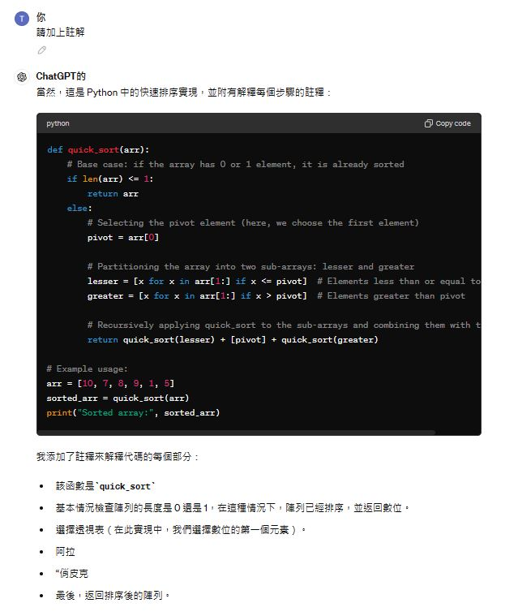
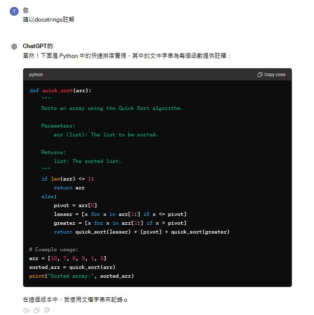
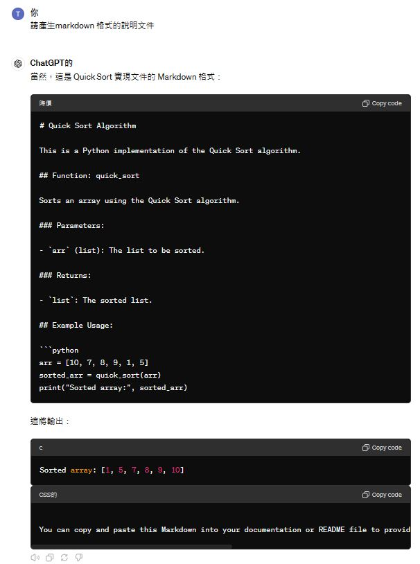

# 程式註解 GenAI_Python_Code_annotation
- 程式註解_Labs_1
  - `提示詞`:請撰寫一個快速排序程式
  - `提示詞`:請加上註解
  - `提示詞`:使用docstrings註解
  - `提示詞`:請產生markdown 格式的說明文件
  - `提示詞`:請產生html 格式的說明文件
  - 輸出成word
  - 輸出成pdf
- 程式註解_Labs_2:  微軟  Copilot
  - `提示詞`:write a numpy program for fibanacci sequence
  - `提示詞`:請加上註解
  - `提示詞`:請用中文註解
  - `提示詞`:使用docstrings註解
  - `提示詞`:請產生markdown 格式的說明文件
  - 輸出成word
  - 輸出成pdf

## 程式註解_Labs_1  ==> 作業:使用 微軟  Copilot練習一下

### 程式註解:請加上註解

### 程式註解:使用docstrings註解 

### 程式註解:請產生markdown 格式的說明文件

## 程式註解_Labs_2:  微軟  Copilot
