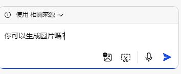

# 微軟Copilot(Bing Chat)
- 2023 年11 月上市
- Microsoft Copilot 是一種Al 生產力工具， 可協調大型語言模型(LLM) 、Microsoft Graph 中的內容以及Microsoft 365 應用程式例如Word 、Excel 、PowerPoint 、Outlook 、Teams 等。
- 提供即時的人工智慧協助，使用戶提高創造力跟生產力。
- 👍️Copilot 可尋即時的資訊
  - Copilot 是以Bing 搜尋引擎服務為基礎，因此可以搜尋即時的資訊，回答也會附上來源連結。所以如果想要尋找有關新科技或是新聞等即時資料， Copilot 是很好的選擇。而ChatGPT 就受限於一定的時限（目前為2023 年4 月之前）
- 👍️Copilot 的Designer(Bing Image Creator) 配載了Open Al 最新開發的DALL-E 3 圖片生成功能。只要打開Copilot 聊天視窗，就能讓Bing用DALL-E 3 模型產生出高品質圖片還完全免費
- 👍️AI 強化的搜尋引擎 ==> 可以語音搜尋 | 圖片搜尋 | 個人照片搜尋
- 可以圖片辨識 ==> 生成文字(圖生文)
- 沒有API (ChatGPT有!)
- 沒有影音生成(Video generation) ? 未來何時會有?


## Chatgpt和microsoft Copilot有何差異?
- Copilot的回答:
```
ChatGPT 和 Microsoft Copilot 是兩個不同的 AI 模型，由不同的公司開發，具有不同的功能和用途：

ChatGPT：
ChatGPT 是由 OpenAI 開發的對話式 AI 模型，旨在回答用戶的問題、提供信息、進行對話等。
它適用於一般性的對話，例如回答問題、寫作、翻譯、創作故事、生成程式碼等。
ChatGPT 不具備特定的內部工具，僅能使用預定義的功能。

Microsoft Copilot：
Microsoft Copilot 是由 Microsoft 開發的 AI 模型，專注於協助軟體開發人員進行編程工作。
它具有內置的程式碼生成功能，可以根據上下文和提示生成程式碼片段。
Microsoft Copilot 可以協助編寫程式、提供建議、生成註釋、自動完成代碼等。
它與 Visual Studio Code 等程式編輯器集成，使開發人員能夠更高效地進行編程工作。

總之，ChatGPT 適用於一般性的對話和創作，而 Microsoft Copilot 專注於程式編寫和開發相關的任務。1234
```
## 文本生成(Text Generation)
- 提問詞: 請列出著名的日本影像風格
- Copilot的回答:
```
日本的影像風格一直以來都受到許多人的喜愛，特別是那種清新、低對比度、略為曝光過度的氛圍。
以下是一些著名的日本影像風格和相關攝影師：

濱田英明 (Hideaki Hamada)：濱田英明以充滿清透、舒適的畫面氛圍聞名。他的作品包括靜物和人像，並以Pentax 67中片幅底片相機拍攝1。
川內倫子 (Rinko Kawauchi)：川內倫子的作品以低彩度、帶點明亮藍綠色調為主。她專注於人像特寫，捕捉生活周遭細微渺小的瑣碎1。
川島小鳥 (Kotori Kawashima)：川島小鳥以捕捉孩子的影像而聞名，他的作品《未來妹妹》系列充滿天使與惡魔的氛圍1。
橫浪修 (Osamu Yokonami)：橫浪修擅長拍攝少女與孩子的主題，作品中充滿平和感。他的系列作品《1000 Children》和《Assembly》廣受好評1。
森榮喜 (Eiki Mori)：森榮喜的作品貼近人與人之間的親暱情感，捕捉日常中微小卻難忘的各個總和1。
奧山由之 (Yoshiyuki Okuyama)：奧山由之的作品以高中生為主角，充滿真實與幻想的視覺映像1。
水谷吉法 (Yoshinori Mizutani)：水谷吉法以大自然為主題，將生活細微幻化為別具唯美的畫面。他的作品《YUSURIKA》以遍布在河堤上的搖蚊科昆蟲為主題1。
這些攝影師的作品都展現了日系攝影風格的獨特魅力，讓人不禁沉浸其中。如果你對日本攝影感興趣，不妨深入了解這些名家的作品，或者自己也嘗試拍攝一些清新、充滿情感的影像吧！
```


- 可以繼續發問
- 可以匯出成 word| pdf | text檔案
- 可以唸給你聽

## 圖片生成(Image Generation)




## Copilot| [Designer(設計工具)](https://www.bing.com/images/create)
- Copilot Designer（創意設計師） 是由 Microsoft 開發的強大 AI 圖像生成工具。
- 它可以根據您輸入的文字創建圖像，利用先進的 AI 模型。
- 以下是關於 Copilot Designer 的一些關鍵點：
  - 圖像創建：Copilot Designer 通過 AI 技術從您的描述中生成圖像。您描述您想要的內容，它會基於您的輸入創建視覺呈現。
  - AI 模型：目前的免費版本 Copilot Designer 使用了 OpenAI DALL·E 3 模型，該模型以其從文本描述生成高質量圖像的能力而聞名 。
  - 易於使用：Copilot Designer 使用起來非常簡單。您提供描述或風格，它會生成各種類型的圖像。它作為 Web 工具提供，並且還有 iOS 和 Android 應用程序，方便在移動設備上使用。
  - 完全免費：最棒的是，Copilot Designer 完全免費，這要歸功於強大的 GPT-4 模型。
  - 隨心所欲地探索 Copilot Designer，發揮您的創造力吧！ 😊

#### Copilot| [Designer(設計工具):[介面](https://designer.microsoft.com/)


### Copilot| [Designer(設計工具):功能


#### 


