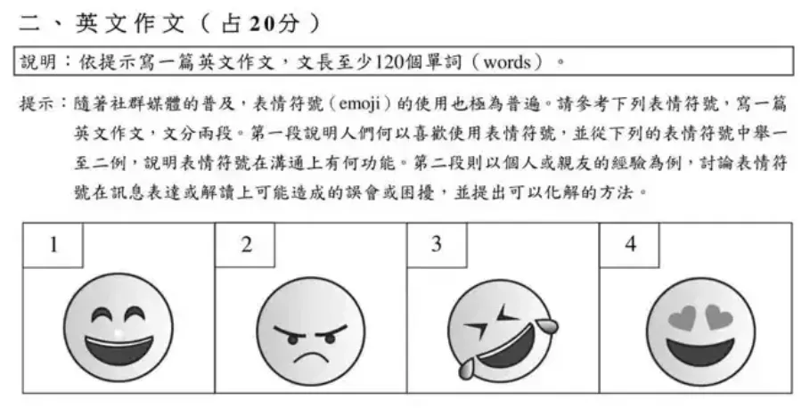
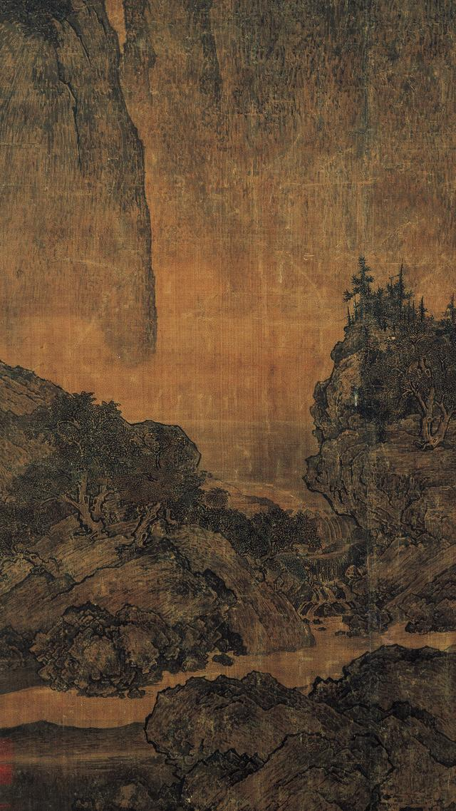

# 微軟Copilot(Bing Chat)實戰
- AI 英文作文
- AI 英文翻譯
- AI 中文作文

## AI 英文翻譯

## AI 英文作文
- 歷屆英文作文題目
  - [歷屆學測作文題目 +大考佳作連結整理](https://happyfish.blog/exam-writing-all/) 


## AI 中文作文
- 歷屆中文作文題目
  - `提示詞`: 歷屆中文作文題目
  - `提示詞`: 台灣歷屆中文作文題目


## 范寬《谿山行旅圖》
- 《谿山行旅圖》為五代末北宋初畫家范寬的作品
- 使用絲質的絹作為畫布，縱長206.3公分，橫寬103.3公分。
- 以淺淡的色彩作極為精緻的構圖，舉凡山川流水、高山岩石皆細心勾勒且呈現出立體的空間感，而人物、馬匹亦能在尺寸極為渺小的限制下活靈活現。據傳明代董其昌評價此畫為「宋畫第一」。
- 現收藏於臺北國立故宮博物院。
- `提示詞`:請針對下列圖象做一首七言絕句


- `Copolit的回答`:當然可以，以下是根據您提供的圖像所創作的七言絕句：
```
山巒如畫靜無聲，
碧水清波映日輝。
古道松風吟遠志，
雲間煙樹隱詩情。
```
這首詩試圖捕捉圖畫中的寧靜與美麗，希望您喜歡！🍃

