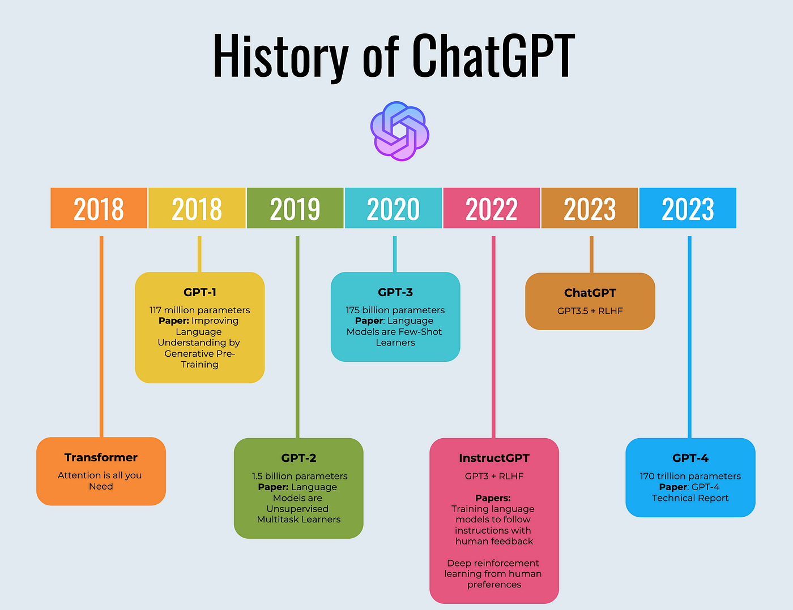

# GenAI的驚艷
## 文本生成與提示工程學(Prompts Engineering)
- ChatGPT的驚艷
  - [ChatGPT Prompts1:基礎技巧](ChatGPT_Basic.md)
  - [ChatGPT Prompts2:進階技巧](ChatGPT_advanced.md)
  - [GhatGPT主題學習](ChatGPT_Topics.md)
  - [付費版 ChatGPT](ChatGPT_Plus.md)
    - ChatGPT 外掛擴充實戰
- 微軟Copilot(Bing Chat)
  - [微軟Copilot(Bing Chat)](Bing.md)
  - [Bing|Copilot實戰](Bing_labs.md)
  - 付費版Microsoft Copilot Pro
- Google Gemini 網址[Google Gemini‎- chat to supercharge your ideas](https://gemini.google.com/)
  - 付費版 Google Gemini Pro
- Anthropic Claude  [網址](https://www.anthropic.com/claude)
  - `提問詞`:請列出從第一支iPhone問世到現在的iPhone型號和發表時間，包括年、月、日 

# 更多AI BOT
- [Monica:一站式AI 助手ChatGPT 中文版](https://monica.im/)
- [Poe | Platform for Open Exploration(開放探索平台)](https://poe.com/)
- [Quora - A place to share knowledge and better understand the world](https://www.quora.com/)
- 人工智慧搜尋平台 Perplexity [網址](https://www.perplexity.ai/)
- [ChatPDF:Chat with any PDF](https://www.chatpdf.com/)
- [使用 Python 串接 GhatGPT](https://steam.oxxostudio.tw/category/python/example/openai.html) 

# AI工具
- [Civitai: The Home of Open-Source Generative AI]()
- [Futurepedia - Find The Best AI Tools & Software](https://www.futurepedia.io/)
- [Awesome GPT Store](https://github.com/devisasari/awesome-gpt-store#ai-art)

## ChatGPT發展史

- GPT-1(2018年): 1億1700 萬個參數
- GPT-2(2019年): 15億個參數
- GPT-3(2020年): 120 億個參數
- GPT-3.5(2022年11月30日):1750 億個參數
- GPT-4(2023年3月4日): 10萬億個參數
- GPT-4 Turbo(2023年11月7日):170 萬億個參數
