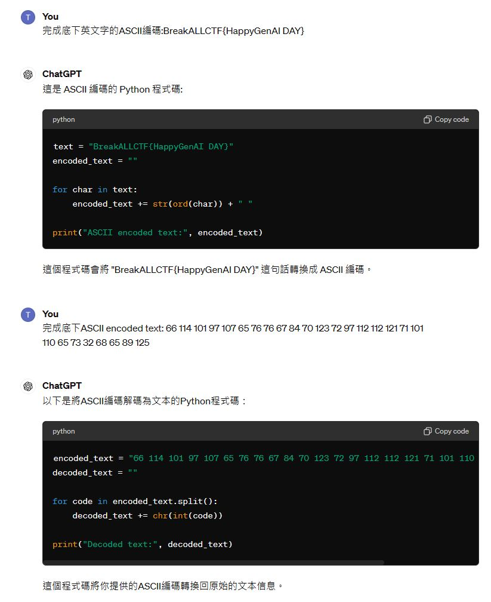

# 使用ChatGPT解CTF題目
## ASCII編碼(encode)與解碼(decode)
- `提問詞`:完成底下英文字的ASCII編碼:BreakALLCTF{HappyGenAI DAY}
- `提問詞`:使用Python程式完成底下英文字的ASCII編碼:BreakALLCTF{HappyGenAI DAY}


- `提問詞`:使用C程式完成底下ASCII encoded text: 66 114 101 97 107 65 76 76 67 84 70 123 72 97 112 112 121 71 101 110 65 73 32 68 65 89 125 的解碼


- 少了`#include <string.h>`
```c
#include <stdio.h>
#include <string.h>
#include <stdlib.h>

int main() {
    char encoded_text[] = "66 114 101 97 107 65 76 76 67 84 70 123 72 97 112 112 121 71 101 110 65 73 32 68 65 89 125";
    char decoded_text[1000];
    int i = 0;
    char *ptr = strtok(encoded_text, " ");

    while (ptr != NULL) {
        decoded_text[i++] = atoi(ptr);
        ptr = strtok(NULL, " ");
    }
    decoded_text[i] = '\0';

    printf("Decoded text: %s\n", decoded_text);

    return 0;
}
```
- [online_c_compiler](https://www.onlinegdb.com/online_c_compiler)


# 使用ChatGPT解CTF題目:古典密碼學
- 凱薩密碼
  - [凱撒密碼 - 維基百科，自由的百科全書](https://zh.wikipedia.org/zh-tw/%E5%87%B1%E6%92%92%E5%AF%86%E7%A2%BC)
  - [凱薩密碼加解密平台](https://cryptii.com/pipes/caesar-cipher)
  - 明文(PlainText):BreakALLCTF{Have A GenAI Day}
  - 加密方式:rot7 

  - 密文(Ciphertext):IylhrHSSJAM{Ohcl H NluHP Khf}
  - 解密方式:

  - CHatGPT
    - `提問詞`:使用Caesar cipher加密BreakALLCTF{Have A GenAI Day} 


