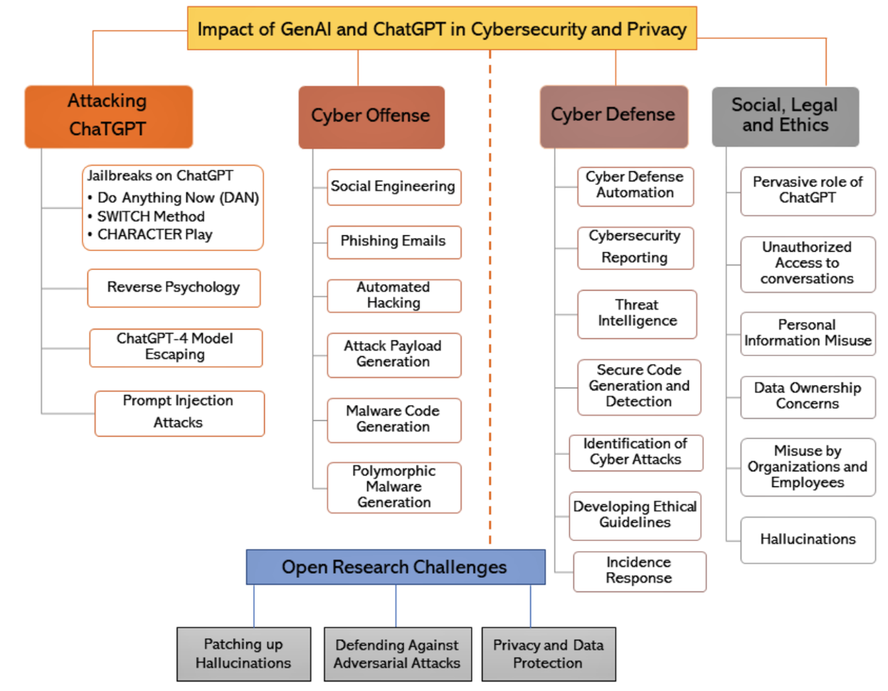

# GenAI|ChatGPT for Cybersecurity
- [ChatGPT For CTF (MyFirstSecurity)](ChatGPT4CTF.md)
- GenAI|ChatGPT for Cybersecurity GenAI_Sec資安實戰
- GenAISec全球發展
- OWASP Top 10 for Large Language Model Applications

# GenAI|ChatGPT for Cybersecurity
- [From ChatGPT to ThreatGPT: Impact of Generative AI in Cybersecurity and Privacy(2023)](https://arxiv.org/abs/2307.00691)
- [Large Language Models in Cybersecurity: State-of-the-Art(2024)](https://arxiv.org/abs/2402.00891)

- 主題
  - GenAI-powered SOC
    - [The benefits of GenAI by SOC function(April 30, 2024)](https://redcanary.com/blog/security-operations/benefits-of-genai-by-soc-function/) 
  - GenAI-powered SOAR 
- 書籍[ChatGPT for Cybersecurity Cookbook(2024)](https://www.packtpub.com/product/chatgpt-for-cybersecurity-cookbook/9781805124047)
    - [ChatGPTHacker](ChatGPTHacker.md) 

# GenAISec全球發展
- Microsoft Security Copilot: AI-Powered Security
- Google Security AI Workbench
- FortiAI| [AI-powered Security Assistant](https://www.fortinet.com/products/fortiai)

## Microsoft Copilot for Security 
- [Microsoft Security Community](https://www.youtube.com/@MicrosoftSecurityCommunity)
- [官方網址](https://www.microsoft.com/zh-tw/security/business/ai-machine-learning/microsoft-copilot-security)
- https://www.microsoft.com/zh-tw/security
- [Microsoft Copilot for Security: AI-Powered Security for All](https://www.youtube.com/watch?v=sNaxv2zflmc)
- [Getting started with Copilot for Security](https://www.youtube.com/watch?v=6qR7PyRMoQ8)
- [TI at Machine Speed: Using MDTI in Copilot for Security](https://www.youtube.com/watch?v=tdZ6UivzrTQ)
- [Microsoft Security Copilot: AI-Powered Defense Strategies 2024 | Peter Rising MVP](https://www.youtube.com/watch?v=q4nF2eHw7Fc)

## Google Cloud Security AI Workbench(2023年)
- Google發布整合自家網絡安全大型語言模型（LLM）Sec-PaLM大型語言模型的Security AI Workbench平臺
- Sec-PaLM適用於不同安全防護用途，可整合各種安全情報，包括Google所收集到的安全威脅情況資料，以及Mandiant在安全漏洞、惡意軟件、威脅偵測和威脅發動人士資訊等方面的第一手情報
- https://www.tenlong.com.tw/products/9789860654332?list_name=i-r-zh_tw

## [WDTA 世界數位技術學院(World Digital Technology Academy)](https://wdtacademy.org/)
- WDTA成立於2023年4月
- 2024年4月15日至19日，第27屆聯合國科技大會在瑞士日內瓦召開。
- 2024年4月WDTA 總部揭牌正式開啟重新定義全球數位技術的使命。
- WDTA創始理事長Peter Major表示：“WDTA致力於成為數字技術創新引領者，推進國際科技合作，攜手合作夥伴服務於全球社會的共同利益，不讓任何一個人掉隊”。
- WDTA匯聚了全球最傑出的智慧，擁有108位創始院士，多數為世界頂級科技大獎獲得者，包括諾貝爾物理學獎獲得者、量子物理領軍人Gerard’t Hooft，圖靈獎獲得者、網際網路領軍人Vint Cerf，圖靈獎獲得者、數據科學領軍人Barbara Liskov和人工智慧領軍人物Geoffrey Hinton等，凸顯了WDTA利用技術造福全球的決心，展現了WDTA在全球數字技術領域的引領地位。
- 此外，Microsoft、Google、Nvidia和華為等科技企業加入WDTA，加大了推動數字技術的創新與國際合作的進程。
- WDTA聯合創始人兼執行理事長李雨航院士表示：“WDTA秉承速度、安全、共用的原則推動數字技術發展，旨在成為全球數字標準的制定者、技術創新的引領者以及國際合作的重要橋梁。”
- 在成立一週年內，WDTA取得纍纍碩果。此次會上，WDTA發佈了WDTA AI STR（安全、信任、負責任）系列標準和教育項目，包括“生成式人工智慧應用安全標準”和“大語言模型安全測試方法”，以及“生成式AI人才發展框架”，認證首席AI官和AI安全專家等課程項目，旨在為AI安全評估和測試領域樹立全新的標準，併為培養數字技術提供引領性的思路和方案。
- 會上，WDTA世界數字技術院副理事長、DWC數字世界大會執行主席徐亭在重點項目發佈環節中，對WDTA在2024年即將實施的三大領域九大項目進行了重點介紹，包括WDTA發起人私董會項目、合夥人加盟計劃及依託機構運營計劃，還發佈了數字世界大會（DWC）系列活動，包括DWC日內瓦峰會、DWC臨空論壇、DWC新加坡峰會等，WDTA投資委員會的新質生産力公益基金項目、WDTA元宇宙委員會的元宇宙創新聯合體發展計劃、WDTA教育委員會的粵港澳大灣區數字人才中心，凸顯了WDTA在引領數字技術賦能科技創新、數實融合推動人類進步的全球影響力。
- 2024年4月16日，在以 “塑造AI的未來” 為主題的AI專題會上，世界數位技術院（WDTA）發佈了包括《生成式人工智慧應用安全測試標準》和《大語言模型安全測試方法》兩項國際標準在內的一系列成果。這是國際組織首次就大模型安全領域發佈國際標準，代表全球人工智慧安全評估和測試進入新的基準。
- 《生成式人工智慧應用安全測試標準》Generative AI Application Security Testing and Validation Standard
  - [下載點](https://www.wdtacademy.org/publications/GenerativeAiApplicationSecurityTestingAndValidationStandard)
  - 此標準為測試和驗證生成式AI應用的安全性提供了一個框架，特別是那些使用大語言模型（LLM）構建的應用程式。
  - 它定義了人工智慧應用程式架構每一層的測試和驗證範圍，包括基礎模型選擇、嵌入和向量資料庫、RAG或檢索增強生成、AI應用運行時安全等等，確保AI應用各個方面都經過嚴格的安全性和合規性評估，保障其在整個生命週期內免受威脅和漏洞侵害。
- 《大語言模型安全測試方法》Large Language Model Security Testing Method
  - [下載點](https://wdtacademy.org/publications/LargeLanguageModelSecurityTestingMethod)
  - 
- [AI STR](https://wdtacademy.org/keys/aiStr)
  - The AI STR program is a comprehensive framework designed to ensure the Safety, Trustworthiness, and Responsibility of artificial intelligence systems. 

## [OWASP Top 10 for Large Language Model Applications](https://owasp.org/www-project-top-10-for-large-language-model-applications/)
- a list of the top 10 most critical vulnerabilities often seen in LLM applications1.
- 1.Prompt injections
- 2.Insecure output handling
- 3.Training data poisoning
- 4.Model denial-of-service (DoS)
- 5.Supply chain vulnerabilities
- 6.Sensitive information disclosure
- 7.Insecure plugin design
- 8.Excessive agency
- 9.Data leakage
- 10.Unauthorized code execution
- [Comprehensive Guide to Large Language Model (LLM) Security](https://www.lakera.ai/blog/llm-security)
## 實戰主題
- [2023十大資安漏洞](https://www.ithome.com.tw/article/162080)
  - No.1：CVE-2023-34362 MOVEit檔案傳輸軟體漏洞
  - No.2：CVE-2023-4966 Citrix NetScaler漏洞
