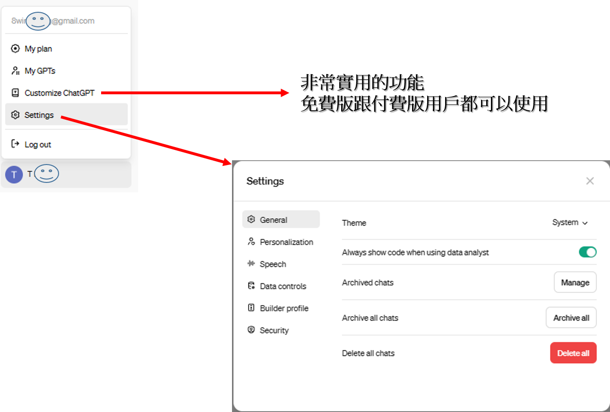
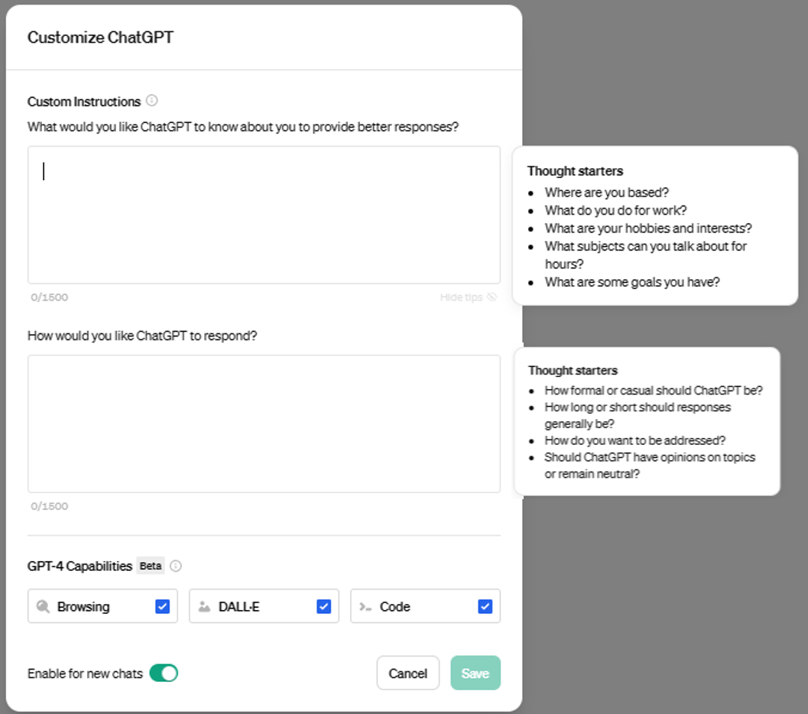
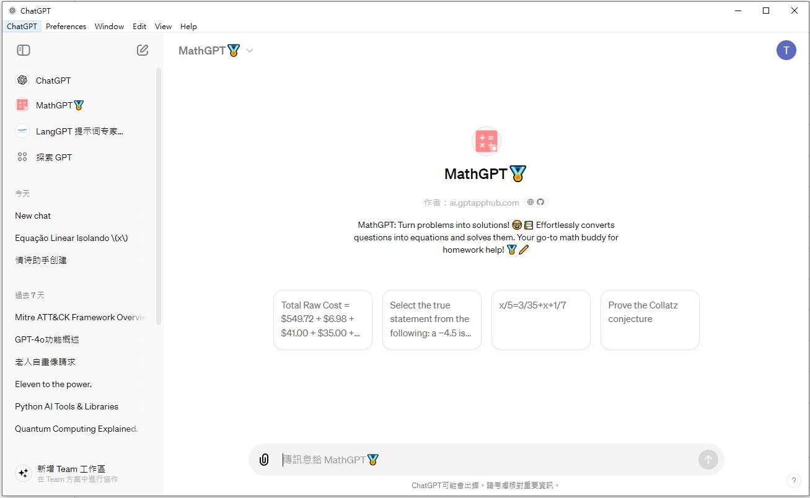

# ChatGPT提示工程學(Prompts Engineering)
## 簡單範例
- `提示詞`:請利用流程方法(Process Approach)說明滲透測試作業的關鍵活動,輸入與輸出及資產?
- `提示詞`:請說明滲透測試作業的輸入與輸出?
- `提示詞`:詳細說明chatgpt的原理要20 頁
- `提示詞`:請問最有名的川菜有哪些

## 通用提示詞範本： 定義角色十背景資訊十任務目標十輸出要求


# 參考書籍
- [ChatGPT Prompts Book - Precision Prompts, Priming, Training & AI Writing Techniques for Mortals](https://www.packtpub.com/product/chatgpt-prompts-book-precision-prompts-priming-training-ai-writing-techniques-for-mortals/9781835881682)


# Prompts(提示詞) 範本網站
- [🤖 ChatGPT 中文指南 🤖](https://github.com/EmbraceAGI/awesome-chatgpt-zh)
- [ChatGPT指令大全](https://www.explainthis.io/zh-hant/chatgpt)
- [🧠 Awesome ChatGPT Prompts](https://github.com/f/awesome-chatgpt-prompts)
- AIPRM for ChatGPT 外掛工具[AIPRM: Your Cheat Code for AI like ChatGPT, Midjourney & DALL-E](https://www.aiprm.com/)
  - [超強ChatGPT 外掛工具 AIPRM for ChatGPT 完全上手教學攻略](https://mrmad.com.tw/aiprm-for-chatgpt) 
- [GreatAIPrompts - AI Prompts, AI Tools and AI News](https://www.greataiprompts.com/)
- [EasyPrompt Library | Find the best ChatGPT Prompts](https://library.easyprompt.xyz/)
- 付費網站[PromptBase | Prompt Marketplace: Midjourney, ChatGPT, DALL·E, …](https://promptbase.com/)

# ChatGPT_Labs

## ChatGPT_Labs:ChatGPT 翻譯機
- `ChatGPT提示詞`:Translate “______” into French
- `ChatGPT提示詞`:Translate into French: “______”
- 進階技術
  - 步驟1:先輸入一般翻譯 ==> Translate: “____________”
  - 步驟2:接著使用  ==> Optimize it
- ChatGPT Vs. Google Translate

#### ChatGPT_Labs:客製化的輔導(Personalized Tutoring):商業戰略Business Strategy Exploration撰寫
```
I run a small e-commerce business selling handmade crafts.
Can you help me brainstorm innovative strategies to expand my customer base and increase online sales?
我經營著一家小型電子商務企業，銷售手工工藝品。
您能幫我集思廣益，制定創新策略來擴大客戶群並增加在線銷售額嗎？
```
```
當然！作為一家銷售手工工藝品的小型電子商務企業，
您可以考慮以下創新策略來擴大客戶群並增加在線銷售額：

深入了解目標客戶群：
定義您理想的客戶概況，分析特徵、人口統計和偏好。
創建詳細的買家人物，以了解他們的需求和動機。

提供卓越的客戶服務：
瞭解客戶需求，根據其特定需求量身定制服務。
培訓員工始終提供優質服務。

優化您的網站：
確保您的網站適用於移動設備並具有響應式設計。
使用清晰的導航、高質量的圖片和詳細的產品描述。
提供多種付款選項並簡化結帳流程。

有效的營銷策略：
啟動針對理想受眾的付費廣告活動。
與影響者合作以擴大受眾。
利用社交媒體營銷和電子郵件活動。
啟用應用內購物功能，實現無縫體驗。

優化用戶體驗：
通過改進網站導航和加載時間減少購物車放棄率。
根據用戶行為提供個性化建議。

與微型影響者合作：
與在您產品相關的特定領域擁有追隨者的微型影響者合作。
他們真實的背書可以吸引新客戶。

記住，持續監測、測試並根據數據和客戶反饋調整策略對於可持續增長至關重要。祝您的電子商務業務一切順利！ 😊

如果您需要更詳細的信息，您可以參考ExactBuyer的有效策略和Shopify的電子商務增長策略。
```
```
I'm looking to enter the digital marketing industry with a new agency.
Could you provide insights on potential market gaps and help me explore unique business models that could set my agency apart?
我希望通過一家新機構進入數位營銷行業。
您能否提供有關潛在市場差距的見解，並説明我探索可以使我的機構與眾不同的獨特商業模式？
```
```
I manage a local restaurant chain and I want to enhance customer loyalty.
Can you suggest creative ways to improve our customer experience and stand out in a competitive market?
我管理著一家本地連鎖餐廳，我想提高客戶忠誠度。
您能提出一些創造性的方法來改善我們的客戶體驗並在競爭激烈的市場中脫穎而出嗎？
```
#### ChatGPT_Labs:客製化的輔導(Personalized Tutoring):職業指導Career Coaching
```
I'm considering a career change, but I'm not sure which direction to go.
Can you help me identify transferable skills and suggest industries that align with my interests?

I have an upcoming job interview for a marketing role.
Could you give me tips on how to answer common interview questions and highlight my relevant skills and experiences?


I'm a recent graduate looking to enter the finance sector.
Can you provide guidance on building a strong resume and networking effectively within the industry?
```
#### ChatGPT_Labs:客製化的輔導(Personalized Tutoring):財務指導Financial Guidance
```
I'm planning to invest in the stock market but I'm new to this.
Can you explain some basic investment principles and provide tips on how to research and select promising stocks?

I want to understand the basics of budgeting and managing my personal finances.
Can you explain concepts like saving, budget categories, and debt management?

I'm considering taking out a mortgage for my first home.
Can you help me understand the factors that influence mortgage rates and provide some insights into the loan application process?
```
#### ChatGPT_Labs:客製化的輔導(Personalized Tutoring):語言練習
```
我正在學習法語，我想練習用將來時態寫句子。
你能幫我用不同的動詞寫幾個句子嗎？

我正在學習西班牙文，我對何時使用“ser”和“estar”感到困惑。
你能提供一些例子來澄清它們的用法嗎？

我正在練習我的日語寫作技巧。
你能幫我寫一小段用日語介紹自己嗎？
```
#### ChatGPT_Labs:客製化的輔導(Personalized Tutoring):主題審查
- `提示詞`:我即將參加物理考試，我很難理解牛頓定律。你能用更簡單的術語解釋它們嗎？
- `提示詞`:我有興趣瞭解古代文明的歷史。您能否簡要介紹一下著名的古代文化及其貢獻？
- `提示詞`:我對天文學很好奇，想更多地瞭解太陽系。你能提供有關行星及其特徵的資訊嗎？

- `提示詞`:我即將參加物理考試，我很難理解牛頓定律。你能用更簡單的術語解釋它們嗎？
```
牛頓運動定律描述了物體的運動和外力之間的關係。讓我用簡單的術語來解釋：

第一定律（慣性定律）：如果沒有外力作用於物體，它會保持靜止或保持匀速直線運動。換句話說，物體會保持它原來的運動狀態，這種性質叫做「慣性」。
第二定律（加速度定律）：施加在物體上的外力等於物體的質量乘以加速度。簡單來說，質量越大，施加相同力時的加速度越小；質量越小，加速度越大。
第三定律（作用力與反作用力定律）：當兩個物體互相作用時，彼此施加的力大小相等、方向相反。例如，你坐在椅子上，椅子同樣也對你施加一個反作用力。

希望這些簡單的解釋有助於你理解牛頓定律！如果你還有其他問題，歡迎告訴我！
```
#### ChatGPT_Labs:客製化的輔導(Personalized Tutoring):技術援助
- `提示詞`:我需要瞭解我的小型企業的一些基本會計概念。你能解釋一下現金流和利潤之間的區別嗎？
- `提示詞`:我正在準備我的稅款，我對扣除有疑問。您能否提供一些關於{您所在國家/稅務管轄區}中個人的常見稅收減免的一般資訊？
- `提示詞`:我想瞭解更多關於 Web 開發的資訊。您能解釋一下前端和後端開發之間的區別以及它們在創建網站中的作用嗎？

#### ChatGPT_Labs:客製化的輔導(Personalized Tutoring):寫作協助
- `提示詞`:我正在為我的文學課寫一篇文章。你能幫我為我的論文想出一個強有力的論文陳述和大綱嗎？
- `提示詞`:我正在寫一個短篇小說，我正在為描述性語言而苦苦掙扎。您能舉例說明如何使用圖像創建生動的場景嗎？
- `提示詞`:我想提高我的專業電子郵件寫作技巧。您能否查看我撰寫的電子郵件草稿，並提出使其更有效的建議？

## 客製化ChatGPT ==> Customize ChatGPT
- Customize ChatGPT是非常實用的功能
- 免費版跟付費版用戶都可使用
- 把ChatGPT 客製化，讓它可以自動生成更精準、更符合個人需求的回答。
- 善用這個功能可以省下很多跟ChatGPT 來回溝通的時間
- 特別適合那些需要大量生成「特定格式或風格」答案的用戶，像是翻譯、文案、企劃丶書信、寫程式，甚至是學某個專業領域都很適合使用
  




## ChatGPT4 Turbo 萬用手冊
```
1-17
台灣在哪裡?

1-18
海峽是什麼?
--------------------------------
請給我國小生可以懂得簡短說明

1-28
我是大學剛畢業的文科生，從小數理科目就不太好，專業名詞或技術請盡量用白話文，
雖然是文科生，但英文也沒有特別好，所以請少用英文。我中文很好，沒法忍耐錯字，請多斟酌你的用詞遭字
--------------------------------
1.若我沒有特别指示,任何情況下都用符合台灣本地用語的繁體中文回覆我。
2.回覆前請務必檢查上述第1點有沒有符合。
3.沒有特別指示，請避免使用 source code 模式。
4.若我有提示要"檢查"，請轉換用英文上網瀏覽你的資訊是否正確，再用中文回覆我。
5.若我有提示要"排整齊"，請以表格形式回覆我。

1-29
我是商管系畢業，有兩年工作經驗，目前在汽車公司擔任企劃。
日常工作為品牌關係維護、擬定行銷策路、市場調查，不定期辦理公司的實體或線上活動。
--------------------------------
文字輕鬆但知識含量高，需要具體的內容並附上連結。
每個對話都需要提供一個提案，且加上SWOT的分析。不要有杜撰的内容。

1-30
公司要辦線上的新品展售會，展演場地需要同時擺放我們的產品，需要場地推薦，還有增加民眾觀看意願與互動性的方法

1-32
你覺得瘦子帥不帥
```

### 桌面版 ChatGPT
- 下載 [ChatGPT_1.1.0_windows_x86_64.msi](https://github.com/lencx/ChatGPT/releases)



### 手機版 ChatGPT
- [蘋果手機](https://apps.apple.com/tw/app/chatgpt/id6448311069)
- [Android手機](https://play.google.com/store/apps/details?id=com.openai.chatgpt&pli=1)
