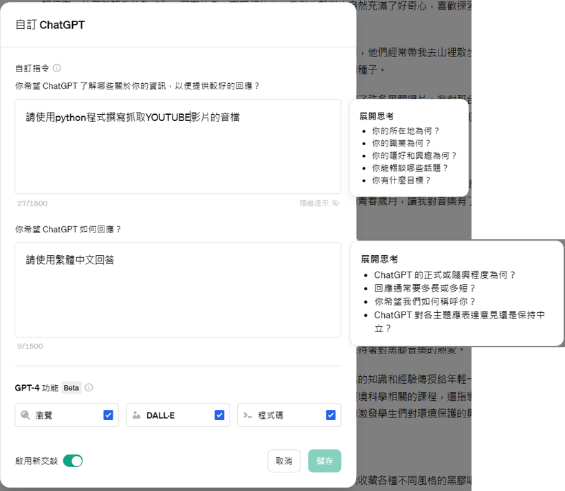
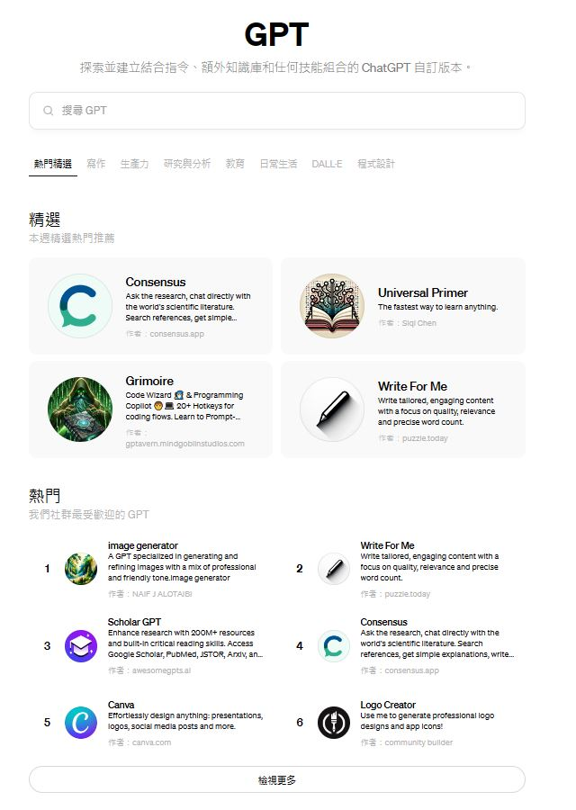
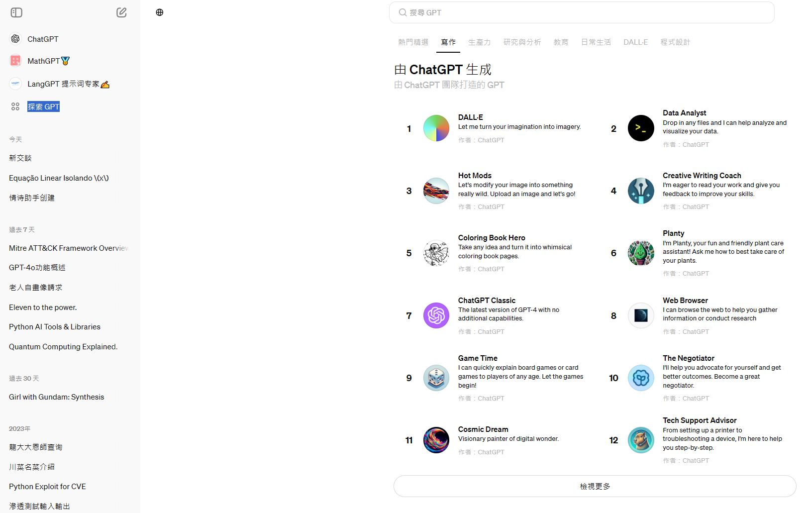

# ChatGPTæ示工程學(Prompts Engineering)
- [使用ChatGPT](https://chatgpt.com/)
- [使用OpenAI Playground](https://platform.openai.com/playground)
- [OpenAI developer platform:官方說æ˜æ–‡ä»¶](https://platform.openai.com/docs/overview)
- [OpenAI developer platform:API reference](https://platform.openai.com/docs/api-reference)
## 簡單範例 [使用ChatGPT](https://chatgpt.com/)
- `æ示è©`:請利用æµç¨‹æ–¹æ³•(Process Approach)說æ˜æ»²é€æ¸¬è©¦ä½œæ¥­çš„é—œéµæ´»å‹•,輸入與輸出åŠè³‡ç”¢?
- `æ示è©`:請說æ˜æ»²é€æ¸¬è©¦ä½œæ¥­çš„輸入與輸出?
- `æ示è©`:詳細說æ˜chatgptçš„åŸç†è¦20 é 
- `æ示è©`:è«‹å•æœ€æœ‰åçš„å·èœæœ‰å“ªäº›

## [官方æ示è©å·¥ç¨‹(Prompt engineering)](https://platform.openai.com/docs/guides/prompt-engineering)
- ç²å¾—更好çµæœçš„六種策略(Six strategies for getting better results):
  - 1.寫清楚的說æ˜(Write clear instructions)
  - 2.æä¾›åƒè€ƒæ–‡æœ¬(Provide reference text)
  - 3.將複雜的任務拆分為更簡單的å­ä»»å‹™(Split complex tasks into simpler subtasks)
  - 4.給模å‹æ™‚間“æ€è€ƒâ€(Give the model time to "think")
  - 5.使用外部工具(Use external tools)
  - 6.系統地測試更改(Test changes systematically)
## 通用æ示è©ç¯„本： 定義角色å背景資訊å任務目標å輸出è¦æ±‚


# Prompts(æ示è©) 範本網站
- [🤖 ChatGPT ä¸­æ–‡æŒ‡å— ğŸ¤–](https://github.com/EmbraceAGI/awesome-chatgpt-zh)
- [ChatGPT指令大全](https://www.explainthis.io/zh-hant/chatgpt)
- [🧠 Awesome ChatGPT Prompts](https://github.com/f/awesome-chatgpt-prompts)
- [GreatAIPrompts - AI Prompts, AI Tools and AI News](https://www.greataiprompts.com/)
- [EasyPrompt Library | Find the best ChatGPT Prompts](https://library.easyprompt.xyz/)
- 付費網站[PromptBase | Prompt Marketplace: Midjourney, ChatGPT, DALL·E, …](https://promptbase.com/)
- åƒè€ƒæ›¸ç±[ChatGPT Prompts Book - Precision Prompts, Priming, Training & AI Writing Techniques for Mortals](https://www.packtpub.com/product/chatgpt-prompts-book-precision-prompts-priming-training-ai-writing-techniques-for-mortals/9781835881682)
# ChatGPT_Labs

## ChatGPT_Labs:ChatGPT 翻譯機
- `ChatGPTæ示è©`:Translate “______†into French
- `ChatGPTæ示è©`:Translate into French: “______â€
- 進éšæŠ€è¡“
  - 步驟1:先輸入一般翻譯 ==> Translate: “____________â€
  - 步驟2:æ¥è‘—使用  ==> Optimize it
- ChatGPT Vs. Google Translate

#### ChatGPT_Labs:商業戰略(Business Strategy Exploration)撰寫
```
I run a small e-commerce business selling handmade crafts.
Can you help me brainstorm innovative strategies to expand my customer base and increase online sales?
我經營著一家å°å‹é›»å­å•†å‹™ä¼æ¥­ï¼ŒéŠ·å”®æ‰‹å·¥å·¥è—å“。
您能幫我集æ€å»£ç›Šï¼Œåˆ¶å®šå‰µæ–°ç­–略來擴大客戶群並å¢åŠ åœ¨ç·šéŠ·å”®é¡å—？
```
```
當然ï¼ä½œç‚ºä¸€å®¶éŠ·å”®æ‰‹å·¥å·¥è—å“çš„å°å‹é›»å­å•†å‹™ä¼æ¥­ï¼Œ
您å¯ä»¥è€ƒæ…®ä»¥ä¸‹å‰µæ–°ç­–略來擴大客戶群並å¢åŠ åœ¨ç·šéŠ·å”®é¡ï¼š

深入了解目標客戶群：
定義您ç†æƒ³çš„客戶概æ³ï¼Œåˆ†æ特徵ã€äººå£çµ±è¨ˆå’Œå好。
創建詳細的買家人物，以了解他們的需求和動機。

æä¾›å“越的客戶æœå‹™ï¼š
ç­è§£å®¢æˆ¶éœ€æ±‚，根據其特定需求é‡èº«å®šåˆ¶æœå‹™ã€‚
培訓員工始終æ供優質æœå‹™ã€‚

優化您的網站：
確ä¿æ‚¨çš„網站é©ç”¨æ–¼ç§»å‹•è¨­å‚™ä¸¦å…·æœ‰éŸ¿æ‡‰å¼è¨­è¨ˆã€‚
使用清晰的å°èˆªã€é«˜è³ªé‡çš„圖片和詳細的產å“æ述。
æ供多種付款é¸é …並簡化çµå¸³æµç¨‹ã€‚

有效的營銷策略：
å•Ÿå‹•é‡å°ç†æƒ³å—眾的付費廣告活動。
與影響者åˆä½œä»¥æ“´å¤§å—眾。
利用社交媒體營銷和電å­éƒµä»¶æ´»å‹•ã€‚
啟用應用內購物功能，實ç¾ç„¡ç¸«é«”驗。

優化用戶體驗：
通é改進網站å°èˆªå’ŒåŠ è¼‰æ™‚間減少購物車放棄ç‡ã€‚
根據用戶行為æ供個性化建議。

與微å‹å½±éŸ¿è€…åˆä½œï¼š
與在您產å“相關的特定領域æ“有追隨者的微å‹å½±éŸ¿è€…åˆä½œã€‚
他們真實的背書å¯ä»¥å¸å¼•æ–°å®¢æˆ¶ã€‚

記ä½ï¼ŒæŒçºŒç›£æ¸¬ã€æ¸¬è©¦ä¸¦æ ¹æ“šæ•¸æ“šå’Œå®¢æˆ¶å饋調整策略å°æ–¼å¯æŒçºŒå¢é•·è‡³é—œé‡è¦ã€‚ç¥æ‚¨çš„é›»å­å•†å‹™æ¥­å‹™ä¸€åˆ‡é †åˆ©ï¼ 😊

如æœæ‚¨éœ€è¦æ›´è©³ç´°çš„ä¿¡æ¯ï¼Œæ‚¨å¯ä»¥åƒè€ƒExactBuyer的有效策略和Shopifyçš„é›»å­å•†å‹™å¢é•·ç­–略。
```
```
I'm looking to enter the digital marketing industry with a new agency.
Could you provide insights on potential market gaps and help me explore unique business models that could set my agency apart?
我希望通é一家新機構進入數ä½ç‡ŸéŠ·è¡Œæ¥­ã€‚
您能å¦æ供有關潛在市場差è·çš„見解，並説æ˜æˆ‘æ¢ç´¢å¯ä»¥ä½¿æˆ‘的機構與眾ä¸åŒçš„ç¨ç‰¹å•†æ¥­æ¨¡å¼ï¼Ÿ
```
```
I manage a local restaurant chain and I want to enhance customer loyalty.
Can you suggest creative ways to improve our customer experience and stand out in a competitive market?
我管ç†è‘—一家本地連é–é¤å»³ï¼Œæˆ‘想æ高客戶忠誠度。
您能æ出一些創造性的方法來改善我們的客戶體驗並在競爭激烈的市場中脫ç©è€Œå‡ºå—？
```
#### ChatGPT_Labs:è·æ¥­æŒ‡å°Career Coaching
```
I'm considering a career change, but I'm not sure which direction to go.
Can you help me identify transferable skills and suggest industries that align with my interests?

I have an upcoming job interview for a marketing role.
Could you give me tips on how to answer common interview questions and highlight my relevant skills and experiences?


I'm a recent graduate looking to enter the finance sector.
Can you provide guidance on building a strong resume and networking effectively within the industry?
```
#### ChatGPT_Labs:財務指å°Financial Guidance
```
I'm planning to invest in the stock market but I'm new to this.
Can you explain some basic investment principles and provide tips on how to research and select promising stocks?

I want to understand the basics of budgeting and managing my personal finances.
Can you explain concepts like saving, budget categories, and debt management?

I'm considering taking out a mortgage for my first home.
Can you help me understand the factors that influence mortgage rates and provide some insights into the loan application process?
```
#### ChatGPT_Labs:èªè¨€ç·´ç¿’
```
我正在學習法èªï¼Œæˆ‘想練習用將來時態寫å¥å­ã€‚
你能幫我用ä¸åŒçš„å‹•è©å¯«å¹¾å€‹å¥å­å—？

我正在學習西ç­ç‰™æ–‡ï¼Œæˆ‘å°ä½•æ™‚使用“serâ€å’Œâ€œestarâ€æ„Ÿåˆ°å›°æƒ‘。
你能æ供一些例å­ä¾†æ¾„清它們的用法å—？

我正在練習我的日èªå¯«ä½œæŠ€å·§ã€‚
你能幫我寫一å°æ®µç”¨æ—¥èªä»‹ç´¹è‡ªå·±å—？
```
#### ChatGPT_Labs:主題學習
- `æ示è©`:我å³å°‡åƒåŠ ç‰©ç†è€ƒè©¦ï¼Œæˆ‘很難ç†è§£ç‰›é “定律。你能用更簡單的術èªè§£é‡‹å®ƒå€‘å—？
- `æ示è©`:我有興趣ç­è§£å¤ä»£æ–‡æ˜çš„æ­·å²ã€‚您能å¦ç°¡è¦ä»‹ç´¹ä¸€ä¸‹è‘—åçš„å¤ä»£æ–‡åŒ–åŠå…¶è²¢ç»ï¼Ÿ
- `æ示è©`:我å°å¤©æ–‡å­¸å¾ˆå¥½å¥‡ï¼Œæƒ³æ›´å¤šåœ°ç­è§£å¤ªé™½ç³»ã€‚你能æ供有關行星åŠå…¶ç‰¹å¾µçš„資訊å—？

- `æ示è©`:我å³å°‡åƒåŠ ç‰©ç†è€ƒè©¦ï¼Œæˆ‘很難ç†è§£ç‰›é “定律。你能用更簡單的術èªè§£é‡‹å®ƒå€‘å—？
```
牛頓é‹å‹•å®šå¾‹æ述了物體的é‹å‹•å’Œå¤–力之間的關係。讓我用簡單的術èªä¾†è§£é‡‹ï¼š

第一定律（慣性定律）：如æœæ²’有外力作用於物體，它會ä¿æŒéœæ­¢æˆ–ä¿æŒåŒ€é€Ÿç›´ç·šé‹å‹•ã€‚æ›å¥è©±èªªï¼Œç‰©é«”會ä¿æŒå®ƒåŸä¾†çš„é‹å‹•ç‹€æ…‹ï¼Œé€™ç¨®æ€§è³ªå«åšã€Œæ…£æ€§ã€ã€‚
第二定律（加速度定律）：施加在物體上的外力等於物體的質é‡ä¹˜ä»¥åŠ é€Ÿåº¦ã€‚簡單來說，質é‡è¶Šå¤§ï¼Œæ–½åŠ ç›¸åŒåŠ›æ™‚的加速度越å°ï¼›è³ªé‡è¶Šå°ï¼ŒåŠ é€Ÿåº¦è¶Šå¤§ã€‚
第三定律（作用力與å作用力定律）：當兩個物體互相作用時，彼此施加的力大å°ç›¸ç­‰ã€æ–¹å‘相å。例如，你å在椅å­ä¸Šï¼Œæ¤…å­åŒæ¨£ä¹Ÿå°ä½ æ–½åŠ ä¸€å€‹å作用力。

希望這些簡單的解釋有助於你ç†è§£ç‰›é “定律ï¼å¦‚æœä½ é‚„有其他å•é¡Œï¼Œæ­¡è¿å‘Šè¨´æˆ‘ï¼
```
#### ChatGPT_Labs:技術æ´åŠ©
- `æ示è©`:我需è¦ç­è§£æˆ‘çš„å°å‹ä¼æ¥­çš„一些基本會計概念。你能解釋一下ç¾é‡‘æµå’Œåˆ©æ½¤ä¹‹é–“çš„å€åˆ¥å—？
- `æ示è©`:我正在準備我的稅款，我å°æ‰£é™¤æœ‰ç–‘å•ã€‚您能å¦æ供一些關於{您所在國家/稅務管轄å€}中個人的常見稅收減å…的一般資訊？
- `æ示è©`:我想ç­è§£æ›´å¤šé—œæ–¼ Web 開發的資訊。您能解釋一下å‰ç«¯å’Œå¾Œç«¯é–‹ç™¼ä¹‹é–“çš„å€åˆ¥ä»¥åŠå®ƒå€‘在創建網站中的作用å—？

#### ChatGPT_Labs:寫作å”助
- `æ示è©`:我正在為我的文學課寫一篇文章。你能幫我為我的論文想出一個強有力的論文陳述和大綱å—？
- `æ示è©`:我正在寫一個短篇å°èªªï¼Œæˆ‘正在為æ述性èªè¨€è€Œè‹¦è‹¦æ™æ‰ã€‚您能舉例說æ˜å¦‚何使用圖åƒå‰µå»ºç”Ÿå‹•çš„場景å—？
- `æ示è©`:我想æ高我的專業電å­éƒµä»¶å¯«ä½œæŠ€å·§ã€‚您能å¦æŸ¥çœ‹æˆ‘撰寫的電å­éƒµä»¶è‰ç¨¿ï¼Œä¸¦æ出使其更有效的建議？

# 客製化ChatGPT ==> Customize ChatGPT
- Customize ChatGPT是é常實用的功能
- å…費版跟付費版用戶都å¯ä½¿ç”¨
- 把ChatGPT 客製化，讓它å¯ä»¥è‡ªå‹•ç”Ÿæˆæ›´ç²¾æº–ã€æ›´ç¬¦åˆå€‹äººéœ€æ±‚çš„å›ç­”。
- 善用這個功能å¯ä»¥çœä¸‹å¾ˆå¤šè·ŸChatGPT 來å›æºé€šçš„時間
- 特別é©åˆé‚£äº›éœ€è¦å¤§é‡ç”Ÿæˆã€Œç‰¹å®šæ ¼å¼æˆ–風格ã€ç­”案的用戶，åƒæ˜¯ç¿»è­¯ã€æ–‡æ¡ˆã€ä¼åŠƒä¸¶æ›¸ä¿¡ã€å¯«ç¨‹å¼ï¼Œç”šè‡³æ˜¯å­¸æŸå€‹å°ˆæ¥­é ˜åŸŸéƒ½å¾ˆé©åˆä½¿ç”¨
  




## ChatGPT4 Turbo è¬ç”¨æ‰‹å†Š 範例
```
我是大學剛畢業的文科生，å¾å°æ•¸ç†ç§‘目就ä¸å¤ªå¥½ï¼Œå°ˆæ¥­åè©æˆ–技術請盡é‡ç”¨ç™½è©±æ–‡ï¼Œ
雖然是文科生，但英文也沒有特別好，所以請少用英文。我中文很好，沒法å¿è€éŒ¯å­—，請多斟酌你的用è©é­å­—
--------------------------------
1.若我沒有特别指示,任何情æ³ä¸‹éƒ½ç”¨ç¬¦åˆå°ç£æœ¬åœ°ç”¨èªçš„ç¹é«”中文å›è¦†æˆ‘。
2.å›è¦†å‰è«‹å‹™å¿…檢查上述第1é»æœ‰æ²’有符åˆã€‚
3.沒有特別指示，請é¿å…使用 source code 模å¼ã€‚
4.若我有æ示è¦"檢查"，請轉æ›ç”¨è‹±æ–‡ä¸Šç¶²ç€è¦½ä½ çš„資訊是å¦æ­£ç¢ºï¼Œå†ç”¨ä¸­æ–‡å›è¦†æˆ‘。
5.若我有æ示è¦"æ’整齊"，請以表格形å¼å›è¦†æˆ‘。
```
```
我是商管系畢業，有兩年工作經驗，目å‰åœ¨æ±½è»Šå…¬å¸æ“”ä»»ä¼åŠƒã€‚
日常工作為å“牌關係維護ã€æ“¬å®šè¡ŒéŠ·ç­–è·¯ã€å¸‚場調查，ä¸å®šæœŸè¾¦ç†å…¬å¸çš„實體或線上活動。
--------------------------------
文字輕鬆但知識å«é‡é«˜ï¼Œéœ€è¦å…·é«”的內容並附上連çµã€‚
æ¯å€‹å°è©±éƒ½éœ€è¦æ供一個æ案，且加上SWOT的分æ。ä¸è¦æœ‰æœæ’°çš„内容。


å…¬å¸è¦è¾¦ç·šä¸Šçš„æ–°å“展售會，展演場地需è¦åŒæ™‚擺放我們的產å“，需è¦å ´åœ°æ¨è–¦ï¼Œé‚„有å¢åŠ æ°‘眾觀看æ„願與互動性的方法


你覺得瘦å­å¸¥ä¸å¸¥
```
### æ¢ç´¢ GPT ==> 付費版有一堆外æ›





- AIPRM for ChatGPT 外æ›å·¥å…·[AIPRM: Your Cheat Code for AI like ChatGPT, Midjourney & DALL-E](https://www.aiprm.com/)
  - [超強ChatGPT 外æ›å·¥å…· AIPRM for ChatGPT 完全上手教學攻略](https://mrmad.com.tw/aiprm-for-chatgpt)

### æ¡Œé¢ç‰ˆ ChatGPT
- 下載 [ChatGPT_1.1.0_windows_x86_64.msi](https://github.com/lencx/ChatGPT/releases)


### 手機版 ChatGPT
- [蘋æœæ‰‹æ©Ÿ](https://apps.apple.com/tw/app/chatgpt/id6448311069)
- [Android手機](https://play.google.com/store/apps/details?id=com.openai.chatgpt&pli=1)
