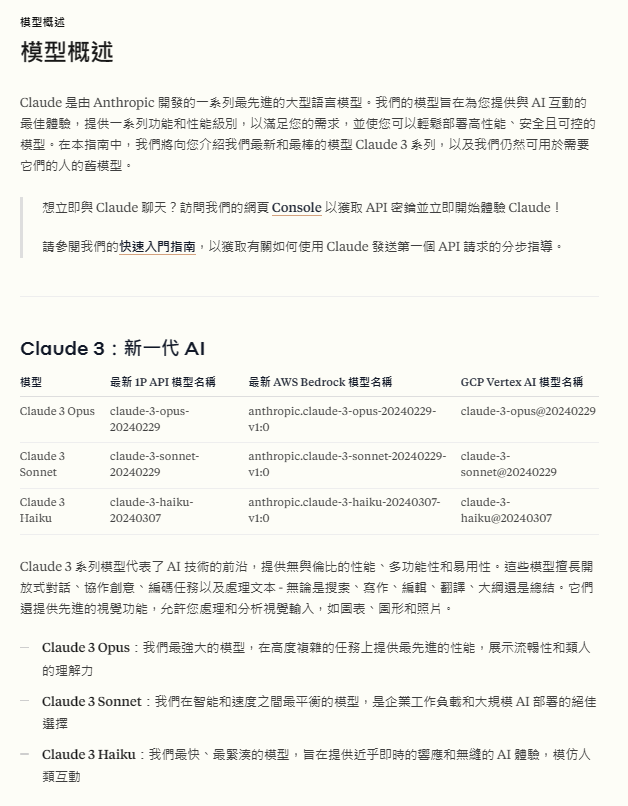
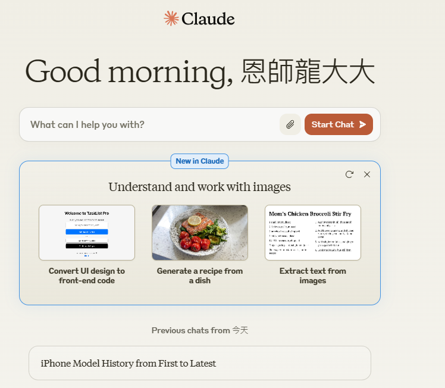
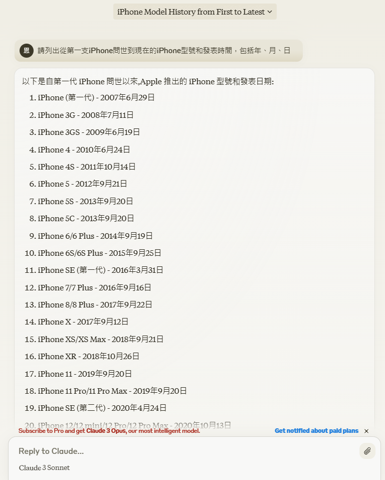
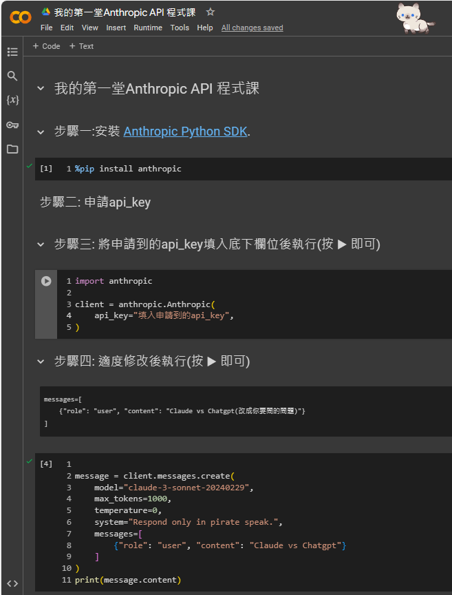

# Anthropic Claude
- Claude 是由 Anthropic 開發的一系列大型語言模型（LLM），旨在改變您與 AI 互動的方式。
- Claude 在涉及語言、推理、分析、編程等各種任務方面表現出色。
- 我們的模型功能強大、易於使用，並可以根據您的需求進行定制.
- Haiku：我們最快的模型，可以執行輕量級操作，具有行業領先的速度。
- Sonnet：我們在效率和吞吐量方面性能最佳的模型。
- Opus：我們最智能的模型，可以處理複雜的分析、多步驟的長期任務以及高階數學和編程任務。
- Claude 可以通過聊天界面和 API 進行訪問，並在保持高度可靠性和可預測性的同時執行各種對話和文本處理任務.
- 您可以隨時隨地與 Claude 進行交流，進行頭腦風暴、獲得答案並分析圖像。
- 我們的 iOS 應用程序將前沿智能的力量放在您的口袋中，您可以在 App Store 上下載。

如果您想要更深入了解 Claude，請隨時詢問！ 😊

## Anthropic Claude:官方
- [網址(點選==>由此去)](https://www.anthropic.com/claude)
- [官方文件](https://docs.anthropic.com/zh-TW/docs/intro-to-claude)
  - [使用者指南(User Guides)](https://docs.anthropic.com/zh-TW/docs/intro-to-claude)
  - [API 參考文件(API Reference)](https://docs.anthropic.com/zh-TW/api/getting-started)
  - [提示語料庫(Prompt Library)](https://docs.anthropic.com/zh-TW/prompt-library/library)
  - [提示語料庫(英文版| 比較好學)](https://docs.anthropic.com/en/prompt-library/library)

## [模型概述](https://docs.anthropic.com/zh-TW/docs/models-overview)

## 登入後介面

## Claude實戰

- `提問詞`:請列出從第一支iPhone問世到現在的iPhone型號和發表時間，包括年、月、日 

## 更多Claude實戰
- [提示語料庫(英文版| 比較好學)](https://docs.anthropic.com/en/prompt-library/library)
- one-page網頁生成[Website wizard: Create one-page websites based on user specifications.](https://docs.anthropic.com/en/prompt-library/website-wizard)

## Claude API實戰

