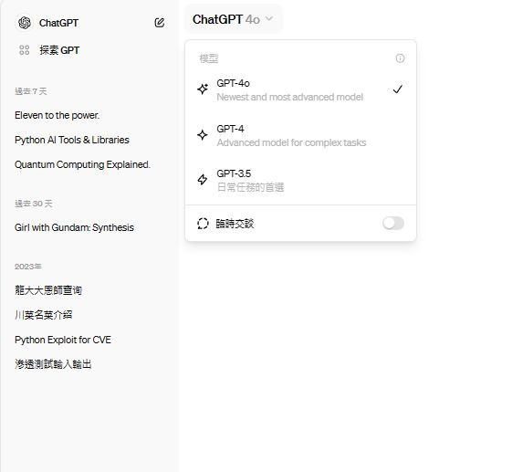

# GPT-4o
- 2024年5月13日重磅發行
- [官方網址](https://openai.com/index/hello-gpt-4o/)
- [使用ChatGPT](https://chatgpt.com/?model=gpt-4o)
- [使用PlayGround](https://platform.openai.com/playground/chat?mode=chat&model=gpt-4o&models=gpt-4o)

## OpenAI 官方影片 [OpenAI@YOUTUBE](https://www.youtube.com/@OpenAI)
- [Introducing GPT-4o](https://www.youtube.com/watch?v=DQacCB9tDaw)
- [OpenAI's ChatGPT-4o Spring Update Event: Everything Revealed in 2 Minutes](https://www.youtube.com/watch?v=jay7kise3PI)
- 即時翻譯功能[Live demo of GPT-4o realtime translation](https://www.youtube.com/watch?v=c2DFg53Zhvw)
## 全球新聞
- [OpenAI 新模型 GPT-4o 登場！能算數、口譯、插話再聊且速度更快，免費開放全用戶使用](https://www.techbang.com/posts/115315-openai-launches-gpt-4o-new-model-it-is-faster)
- [OpenAI最新模型GPT-4o，功能一次看：可聽可看可即時翻譯，反應簡直真人](https://www.businessweekly.com.tw/international/blog/3015580)
- [OpenAI Unveils GPT-4o "Free AI for Everyone"](https://www.reddit.com/r/ChatGPT/comments/1cr4hfd/openai_unveils_gpt4o_free_ai_for_everyone/?rdt=60583)
- [ BBC News | OpenAI's new version of Chat-GPT can teach maths and flirt](https://www.youtube.com/watch?v=ied2AkpfswI)

# GPT-4 vs GPT-4o
- [gpt4o与gpt4.0的实测对比](https://zhuanlan.zhihu.com/p/697587954)

