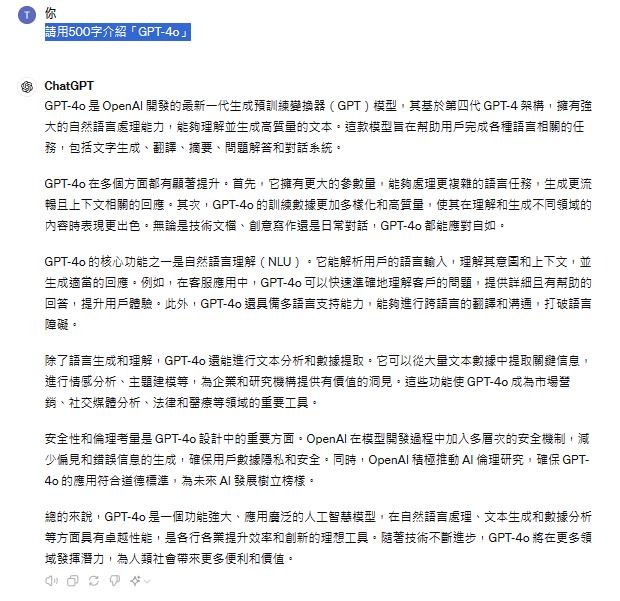
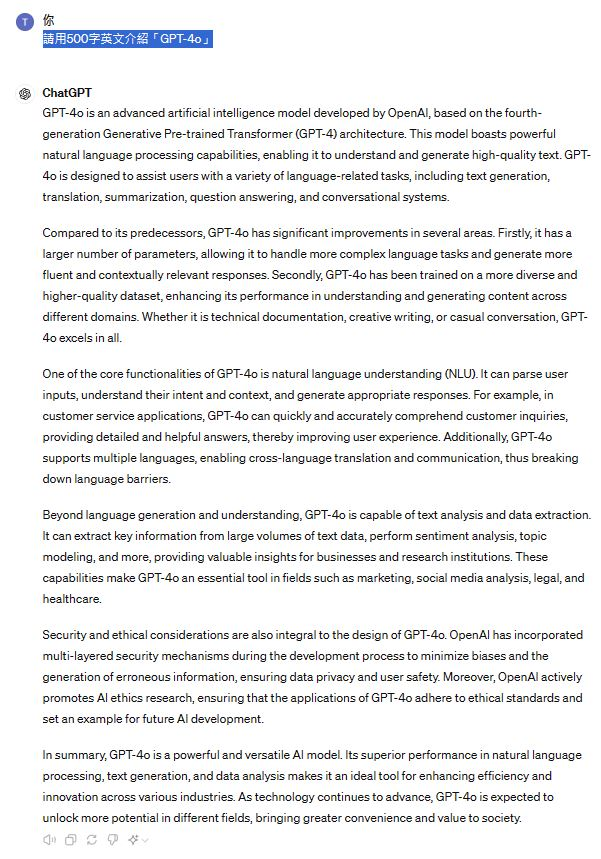
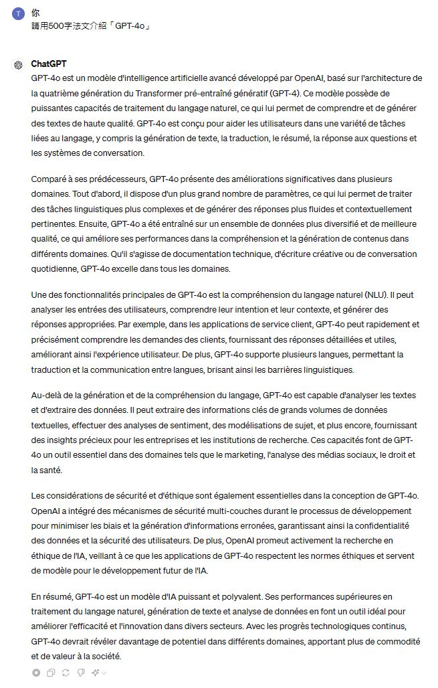
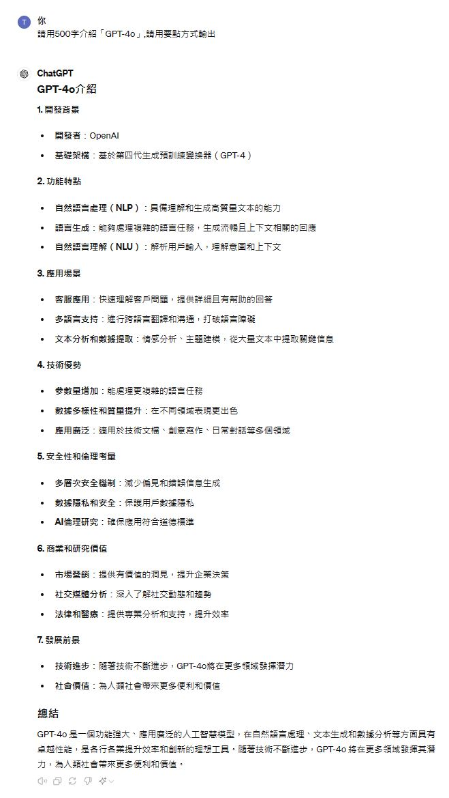
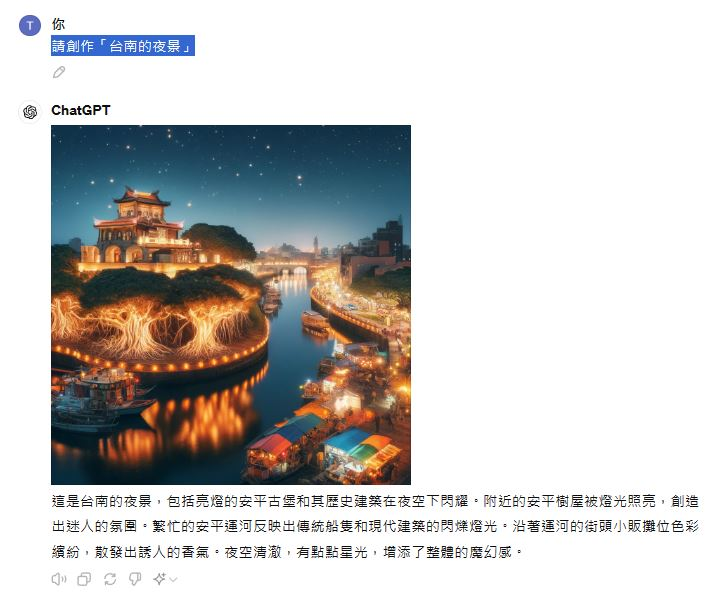
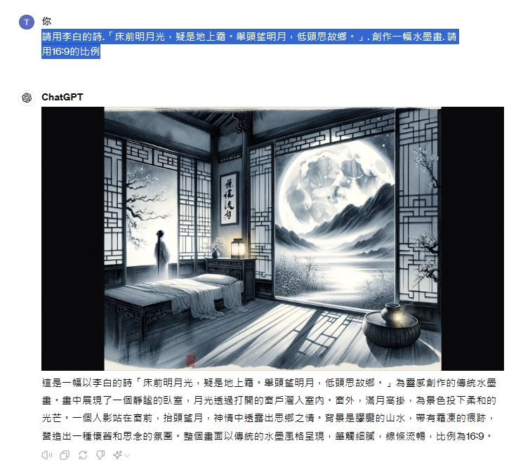
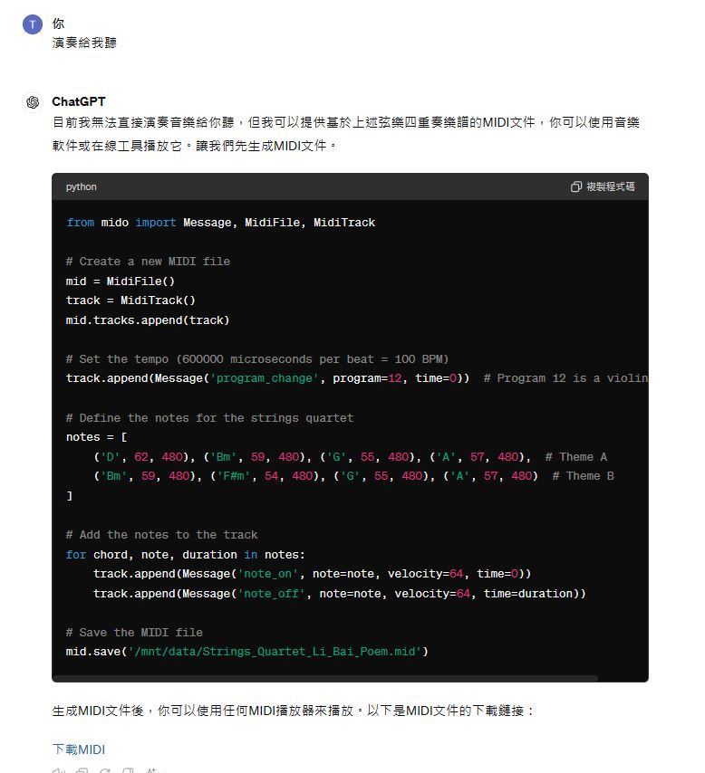

# GPT-4o
- 2024年5月13日重磅發行
- [官方網址](https://openai.com/index/hello-gpt-4o/)
- [使用ChatGPT](https://chatgpt.com/?model=gpt-4o)
- [使用PlayGround](https://platform.openai.com/playground/chat?mode=chat&model=gpt-4o&models=gpt-4o)

## OpenAI 官方影片 [OpenAI@YOUTUBE](https://www.youtube.com/@OpenAI)
- [Introducing GPT-4o](https://www.youtube.com/watch?v=DQacCB9tDaw)
- [OpenAI's ChatGPT-4o Spring Update Event: Everything Revealed in 2 Minutes](https://www.youtube.com/watch?v=jay7kise3PI)
- 即時翻譯功能[Live demo of GPT-4o realtime translation](https://www.youtube.com/watch?v=c2DFg53Zhvw)
## 全球新聞
- [OpenAI 新模型 GPT-4o 登場！能算數、口譯、插話再聊且速度更快，免費開放全用戶使用](https://www.techbang.com/posts/115315-openai-launches-gpt-4o-new-model-it-is-faster)
- [OpenAI最新模型GPT-4o，功能一次看：可聽可看可即時翻譯，反應簡直真人](https://www.businessweekly.com.tw/international/blog/3015580)
- [OpenAI Unveils GPT-4o "Free AI for Everyone"](https://www.reddit.com/r/ChatGPT/comments/1cr4hfd/openai_unveils_gpt4o_free_ai_for_everyone/?rdt=60583)
- [ BBC News | OpenAI's new version of Chat-GPT can teach maths and flirt](https://www.youtube.com/watch?v=ied2AkpfswI)

# GPT-4 vs GPT-4o
- [gpt4o与gpt4.0的实测对比](https://zhuanlan.zhihu.com/p/697587954)

# [ChatGPT-4o實戰_20240515_MITRE ATT&CK](ChatGPT-4o_20240515.md)
# ChatGPT-4o實戰(20240514)
- `提問詞`:請用500字介紹「GPT-4o」
- `提問詞`:請用500字英文介紹「GPT-4o」
- `提問詞`:請用500字法文介紹「GPT-4o」
- `提問詞`:請用500字介紹「GPT-4o」,請用要點方式輸出
- 藝術創作
  - `提問詞`:請創作「台南的夜景」
  - `提問詞`:請創作「台南的夜景」 , 水墨畫
  - `提問詞`:請用李白的詩.「床前明月光，疑是地上霜。舉頭望明月，低頭思故鄉。」. 創作一幅水墨畫. 請用16:9的比例 
- 來寫教科書
  - `提問詞`:我要撰寫一本「GPT-4o」的教科書,請幫我規劃十個章節
  - `提問詞`:請針對上述「人工智慧的歷史與發展」撰寫1000字說明文字
  - `提問詞`:請針對上述「上下文相關性與連貫性」撰寫1000字說明文字
  - `提問詞`:請針對上述「API 與開發工具」撰寫1000字說明文字
- 音樂創作
  - `提問詞`:請用李白的詩.「床前明月光，疑是地上霜。舉頭望明月，低頭思故鄉。」. 創作一首爵士樂 
  - `提問詞`:請用李白的詩.「床前明月光，疑是地上霜。舉頭望明月，低頭思故鄉。」. 創作一首strings quartet
  - `提問詞`:請以樂譜型式輸出
  - `提問詞`:輸出成pdf檔案  ==>[看不懂的成品](./pics/Strings_Quartet_Li_Bai_Poem.pdf)
  - `提問詞`:演奏給我聽
  - `提問詞`:請針對「公主徹夜未眠」作詞
  - `提問詞`:請針對「公主徹夜未眠」作曲
  - `提問詞`:請針對「公主徹夜未眠」作詞,使用三毛的風格
  - `提問詞`:請針對「公主徹夜未眠」作詞,使用席慕蓉的風格
  - `提問詞`: 請產生吉他譜
- 教師
  - `提問詞`:我要開一門研究所的課程,名稱是GenAI與駭客攻防,十八周,請幫我列出課程大綱,要有中英文
  - `提問詞`:我要開一門高中生的課程,名稱是資訊安全概論,十八周,每周兩小時.請幫我列出課程大綱,要有中英文
  - `提問詞`:請幫我出十題資訊安全概論考題,每題有四個答案,請附上解答
  - `提問詞`:請幫我出十題資訊安全概論考題,每題有四個答案,複選題,請附上解答
  - `提問詞`:請幫我出十題Kali linux考題,每題有四個答案,複選題,請附上解答
  - `提問詞`:請幫我出十題nmap考題,每題有四個答案,複選題,請附上解答
  - `提問詞`:請幫我出十題metasploit考題,每題有四個答案,複選題,請附上解答
  - `提問詞`:請幫我出十題sqlmap考題,每題有四個答案,複選題,請附上解答
  - `提問詞`:幫我出十題hashcat考題,每題有四個答案,複選題,請附上解答
  - `提問詞`:請幫我出十題Windows AD考題,每題有四個答案,複選題,請附上解答
  - `提問詞`:請幫我出十題mimikatz考題,每題有四個答案,複選題,請附上解答
  - `提問詞`:請幫我出十題DDoS考題,每題有四個答案,複選題,請附上解答
  - `提問詞`:請幫我出十題ransomware考題,每題有四個答案,複選題,請附上解答
  - `提問詞`:請幫我出十題LDAP injection考題,每題有四個答案,複選題,請附上解答與解說
  - `提問詞`:請幫我撰寫LDAP injection簡報,給高中生看得懂的
  - `提問詞`:請舉例說明MITRE ATT&CK的Privilege Escalation
  - `提問詞`:請舉例說明Windows Privilege Escalation
  - `提問詞`:請舉十個範例說明Windows Privilege Escalation
- 自傳
  - `提問詞`:請幫我寫一份2000字自傳,姓名:曾龍,喜好:聽黑膠,爬山(已經爬過十座台灣百岳,包括合歡西峰)
  - `提問詞`:請幫我寫一份2000字自傳,姓名:曾龍,喜好:聽黑膠,爬山(已經爬過十座台灣百岳,包括合歡西峰),我現在年紀是60歲,副教授
  - `提問詞`:請幫我寫一份2000字自傳,姓名:曾龍,喜好:聽黑膠,爬山,我現在年紀是60歲,副教授,59歲開始爬山,已經爬過十座台灣百岳,包括合歡西峰)
- 音樂
  - `提問詞`:請說明貝多芬交響樂的作曲風格
  - `提問詞`:請說明K.E.Wilkinson的錄音風格
  - `提問詞`:請說明Furtwangler的指揮風格
  - `提問詞`:請問要如何將Chatgpt的聊天存成PDF檔案?

# ChatGPT-4o實戰結果


- `提問詞`:請用500字介紹「GPT-4o」



- `提問詞`:請用500字英文介紹「GPT-4o」



- `提問詞`:請用500字法文介紹「GPT-4o」



- `提問詞`:請用500字介紹「GPT-4o」,請用要點方式輸出


- `提問詞`:我要撰寫一本「GPT-4o」的教科書,請幫我規劃十個章節
- `ChatGPT-4o`的回應:
```
撰寫一本關於「GPT-4o」的教科書，可以從基礎概念到高階應用，全面介紹這一先進的人工智慧技術。
以下是十個章節的規劃，涵蓋基本原理、技術細節、應用實例及倫理考量等方面。

章節規劃
第1章：引言
人工智慧的歷史與發展
GPT-4o 的簡介與重要性
本書的結構與閱讀指南
第2章：生成預訓練變換器（GPT）概述

變換器架構的基本原理
GPT 系列的演變
GPT-4o 的創新與突破

第3章：GPT-4o 的技術基礎
模型架構與設計
訓練數據與預處理
語言模型的訓練方法

第4章：自然語言處理（NLP）核心技術
語言生成與理解
上下文相關性與連貫性
多語言支持與翻譯技術

第5章：GPT-4o 的應用場景
客服系統
創意寫作與內容生成
市場營銷與數據分析
醫療與法律領域的應用

第6章：文本分析與數據提取
情感分析
主題建模
關鍵信息提取

第7章：安全性與倫理考量
偏見與公平性
數據隱私與安全
AI倫理與責任

第8章：GPT-4o 的實作與開發
API 與開發工具
範例代碼與實踐指南
常見問題與解決方案

第9章：高階技術與未來發展
強化學習與自我改進
GPT-4o 與其他 AI 技術的整合
未來的技術趨勢與發展方向

第10章：案例研究與應用實例
成功案例分析
實際應用中的挑戰與解決
不同行業的應用實例

附錄
常用術語表
參考文獻與延伸閱讀
開發者社區與資源

這十個章節將全面覆蓋 GPT-4o 的各個方面，從基礎知識到高階應用，幫助讀者全面了解並掌握這一技術。
```

- `提問詞`:請針對上述「人工智慧的歷史與發展」撰寫1000字說明文字
- `ChatGPT-4o`的回應:
```
人工智慧的歷史與發展
引言
人工智慧（Artificial Intelligence，AI）的發展歷史充滿了創新、挑戰和突破。
自20世紀中葉以來，AI已經從一個理論概念演變成為現代科技的重要支柱，影響著各個行業和日常生活。
這章將探討AI的起源、演變過程和未來發展方向。

起源與早期發展
1. 早期概念與理論基礎
人工智慧的概念最早可以追溯到古希臘時代，當時哲學家們就開始思考機械和人類智能的可能性。
然而，現代AI的理論基礎是在20世紀初逐漸形成的。
艾倫·圖靈（Alan Turing）被認為是AI之父，他在1950年提出了著名的「圖靈測試」，用以衡量機器是否具有智能。

2. 1950-1970年代：AI的誕生與早期探索
1956年，達特茅斯會議（Dartmouth Conference）標誌著人工智慧作為一門學科的誕生。
參會的研究人員提出了「機器可以模擬任何方面的學習或任何其他特徵智能」，這一目標成為早期AI研究的核心。
隨後的幾十年裡，研究者們致力於開發基於規則和邏輯的系統，
例如約翰·麥卡錫（John McCarthy）的LISP語言和赫伯特·西蒙（Herbert Simon）與艾倫·紐維爾（Allen Newell）的邏輯理論家（Logic Theorist）。

AI的冬天與復興
1. 1970-1980年代：AI的第一次寒冬
雖然早期的AI研究取得了一些進展，但大部分系統在處理現實世界中的複雜問題時顯得力不從心。
隨著研究資金的減少和失望情緒的蔓延，AI進入了第一次寒冬（AI Winter）。
這段時期的主要問題是計算能力不足和過於樂觀的承諾無法兌現。

2. 1980-1990年代：專家系統與第二次寒冬
1980年代初，專家系統的出現使得AI研究重新獲得關注。這些系統基於知識庫和推理引擎，可以模擬專家在特定領域的決策過程。
然而，隨著時間的推移，專家系統的局限性逐漸暴露，特別是在面對動態和非結構化的問題時。
這導致了第二次AI寒冬的到來，資金再次減少，研究進展放緩。

機器學習與現代AI
1. 1990年代：機器學習的興起
1990年代中期，隨著計算能力的提高和數據量的增長，機器學習（Machine Learning）開始崭露頭角。
這一時期，研究人員逐漸轉向數據驅動的方法，開發了各種學習算法，如支持向量機（SVM）和隨機森林（Random Forest）。
機器學習的方法使AI系統在處理模式識別和分類任務上取得了顯著進展。

2. 2000年代：大數據與深度學習
進入21世紀後，大數據（Big Data）和深度學習（Deep Learning）的興起標誌著AI進入新的發展階段。
深度學習利用多層神經網絡模擬人腦的學習過程，並在圖像識別、語音識別和自然語言處理等領域取得突破性成果。
2006年，Geoffrey Hinton等人提出了深度信念網絡（Deep Belief Networks），為深度學習的廣泛應用奠定了基礎。

現代AI的應用與挑戰
1. 應用範圍
現代AI已經廣泛應用於各行各業，包括醫療、金融、交通、娛樂等領域。
在醫療領域，AI可以輔助診斷疾病、個性化治療方案；
在金融領域，AI用於風險管理、智能投資；
在交通領域，無人駕駛技術正在逐步實現；
在娛樂領域，AI生成的內容和推薦系統極大地豐富了用戶體驗。

2. 挑戰與倫理考量
儘管AI的發展前景廣闊，但也面臨諸多挑戰和倫理問題。首先，數據隱私和安全是亟待解決的問題。
其次，AI算法可能存在的偏見和歧視問題需要引起重視。此外，AI取代人類工作的可能性引發了對未來就業市場的擔憂。
為此，研究社區和企業需要共同努力，制定合理的監管和倫理框架，確保AI技術的負責任發展。

未來展望
1. 人工通用智能（AGI）
人工通用智能（Artificial General Intelligence，AGI）是AI研究的終極目標，即開發能夠執行任何人類智能能夠完成的任務的機器。
目前，AGI仍然處於概念和初步探索階段，但隨著技術的進步，這一目標可能在未來數十年內逐步實現。

2. AI與其他技術的融合
未來，AI將與其他前沿技術如量子計算、物聯網（IoT）和區塊鏈等進行深度融合，進一步拓展其應用範圍和能力。
這種跨領域的技術融合將促進新型智能系統的誕生，帶來更高效的解決方案和創新應用。

總結
人工智慧的歷史是一段充滿挑戰與創新的旅程。從早期的理論探討到現代的實際應用，AI技術已經深刻改變了我們的生活方式和工作模式。
儘管面臨許多挑戰，AI的發展前景依然令人振奮。
隨著技術的不斷進步和倫理框架的完善，AI將在未來繼續引領科技革命，為人類社會帶來更多的便利和價值。
```


- `提問詞`: 請針對上述「上下文相關性與連貫性」撰寫1000字說明文字
- `ChatGPT-4o`的回應:
```
上下文相關性與連貫性
引言
在自然語言處理（NLP）中，上下文相關性（context relevance）和連貫性（coherence）是兩個關鍵概念，它們對生成高質量的文本至關重要。
上下文相關性指的是文本或對話中的信息是否與其前後文相關聯，而連貫性則指的是整個文本或對話是否在語義和邏輯上保持一致。
本文將深入探討這兩個概念，並解釋其在人工智慧特別是GPT-4o中的重要性和實現方法。

上下文相關性
1. 定義與重要性
上下文相關性是指語言單位（如單詞、句子、段落）在特定上下文中的適當性和相關性。
在自然語言生成（NLG）任務中，上下文相關性決定了模型生成的文本是否能夠符合前後語境，從而使對話或文章更加自然和有意義。

2. 實現方法
實現上下文相關性的方法包括使用注意力機制（attention mechanisms）、序列到序列模型（sequence-to-sequence models）和變換器（transformers）等技術。

注意力機制：這種技術可以讓模型在生成每個單詞或句子時考慮前面所有的內容，從而選擇最相關的信息。注意力機制在變換器架構中尤為重要。

序列到序列模型：這種模型通常用於機器翻譯和文本摘要等任務，通過編碼器-解碼器結構處理上下文信息。
編碼器將輸入序列轉換為一個上下文向量，解碼器根據該向量生成輸出序列。

變換器：變換器是目前最先進的自然語言處理模型之一，
它利用多頭自注意力機制（multi-head self-attention）來處理整個序列的上下文信息，從而生成與上下文高度相關的文本。

3. GPT-4o中的上下文處理
GPT-4o 是基於變換器架構的模型，利用自注意力機制來實現上下文相關性。
每當模型生成一個新單詞時，它會考慮到之前所有生成的單詞及其之間的關係，從而確保生成的文本與前後文高度相關。
這使得GPT-4o在處理長文本和對話時能夠保持高水平的上下文相關性。

連貫性
1. 定義與重要性
連貫性是指文本在語義和邏輯上的一致性，使得讀者或聽者能夠輕鬆理解和連接不同部分的內容。
連貫性是評估文本質量的一個重要標準，尤其是在生成長篇文章或進行對話時。

2. 實現方法
實現連貫性的方法包括使用主題建模（topic modeling）、故事生成（story generation）技術和增強學習（reinforcement learning）等。

主題建模：主題建模技術，如潛在狄利克雷分配（LDA），可以幫助模型識別和保持文本中的主要主題，從而保證文章的連貫性。
故事生成：故事生成技術旨在生成有結構的、連貫的敘述，通常使用情節框架和角色建模等方法。
增強學習：增強學習可以用來訓練模型在生成連貫文本時的策略，通過獎勵連貫性高的生成結果來優化模型的行為。
3. GPT-4o中的連貫性處理
GPT-4o 通過自注意力機制和大規模預訓練數據來實現文本連貫性。自注意力機制可以讓模型在生成文本時同時考慮整個上下文，從而生成連貫的句子和段落。此外，GPT-4o 在訓練過程中接觸了大量不同風格和結構的文本，這使得它能夠學習到如何生成連貫的長篇文章和對話。

上下文相關性與連貫性的挑戰
1. 多輪對話中的上下文維持
在多輪對話中，維持上下文相關性是一大挑戰。模型需要記住之前的對話內容，並根據用戶的新輸入生成相關且連貫的回應。
這需要模型具有強大的記憶和推理能力。

2. 長篇文本的連貫性
生成長篇文本時，保持連貫性同樣具有挑戰性。模型需要能夠連接不同段落和章節，並維持整體主題和結構的一致性。
這要求模型能夠處理大範圍的上下文信息，並在生成過程中保持一致的語義和風格。

3. 消除偏見和確保公正
在處理上下文相關性和連貫性時，消除偏見和確保公正也是重要的挑戰。
模型在訓練過程中可能會接觸到帶有偏見的數據，這些偏見可能會在生成的文本中體現出來。
為了解決這個問題，需要在數據選擇和模型訓練過程中採取措施，以減少偏見和提高公平性。

未來展望
1. 進一步改進上下文處理技術
未來的研究將致力於進一步改進上下文處理技術，以提高模型在多輪對話和長篇文本生成中的表現。
這可能包括開發更高效的注意力機制和增強記憶能力的模型。

2. 提升連貫性生成技術
提升連貫性生成技術也是未來的研究方向。
通過結合情節生成和主題建模技術，可以生成更加連貫和有結構的文本，從而提高用戶體驗。

3. 加強倫理考量與偏見消除
隨著AI技術的不斷發展，加強倫理考量和偏見消除將變得越來越重要。
未來的研究將致力於開發更加公平和透明的模型，確保生成的文本既相關又連貫，同時避免引入不必要的偏見和歧視。

總結
上下文相關性和連貫性是自然語言處理中兩個至關重要的概念，直接影響生成文本的質量和用戶體驗。
通過使用先進的技術如注意力機制、變換器架構和主題建模，現代AI模型如GPT-4o在這些方面取得了顯著的進展。
然而，隨著技術的不斷進步，仍有許多挑戰需要克服。未來的研究將繼續致力於提升模型的上下文處理和連貫性生成能力，同時加強倫理考量，確保AI技術的負責任發展。
```


- `提問詞`:請針對上述「API 與開發工具」撰寫1000字說明文字
- `ChatGPT-4o`的回應:
```
API 與開發工具
引言
隨著人工智慧（AI）技術的發展，API（應用程式介面）和開發工具在AI應用中的作用越來越重要。
API使得開發者能夠輕鬆地將AI功能整合到他們的應用中，而開發工具則提供了便捷的開發環境和豐富的功能，幫助開發者快速實現AI應用。
本文將詳細介紹GPT-4o的API及相關開發工具，並探討其在實際應用中的使用方法和優勢。

API 的作用與重要性
API是介於軟體應用和AI模型之間的一個接口，允許開發者訪問和利用AI模型的功能，而無需深入了解其內部運作。

API的主要作用包括：
簡化開發過程：API提供了標準化的接口，使開發者能夠快速集成AI功能，減少開發時間和成本。
提高可擴展性：通過API，AI模型可以輕鬆擴展到不同的平台和應用中，實現廣泛的應用場景。
保證一致性：使用API可以確保不同應用之間的一致性和可靠性，減少錯誤發生的機會。

GPT-4o 的 API
GPT-4o 提供了功能強大的API，讓開發者能夠輕鬆地訪問和使用其先進的自然語言處理（NLP）功能。

以下是GPT-4o API的主要特點和功能：
文本生成：開發者可以使用API生成高質量、上下文相關的文本，適用於文章撰寫、內容生成等應用。
文本摘要：API能夠將長篇文章摘要為簡潔的段落，有助於快速理解主要內容。
翻譯：API支持多語言翻譯，幫助應用實現跨語言溝通。
情感分析：API能夠分析文本的情感傾向，適用於社交媒體分析、市場調研等領域。
問答系統：API可以根據給定的上下文回答問題，適用於客服系統、教育等應用。

使用 GPT-4o API 的步驟

使用GPT-4o API通常涉及以下步驟：
獲取 API 密鑰：開發者需要從OpenAI獲取API密鑰，這是訪問API服務的憑證。
設置開發環境：根據開發需求選擇合適的編程語言和開發工具，並安裝相關的依賴庫。
發送 API 請求：使用API密鑰發送HTTP請求到GPT-4o服務器，並接收返回的結果。
處理 API 響應：解析API返回的數據，並將其集成到應用中。

以下是使用Python訪問GPT-4o API的示例代碼：

python
複製程式碼
import openai

# 獲取 API 密鑰
openai.api_key = 'YOUR_API_KEY'

# 發送 API 請求
response = openai.Completion.create(
  engine="gpt-4o",
  prompt="Write a short story about a robot learning to play the piano.",
  max_tokens=150
)

# 處理 API 響應
story = response.choices[0].text
print(story)

開發工具
除了API，開發工具在AI應用的開發過程中也扮演著重要角色。以下是一些常用的GPT-4o開發工具：

開發框架：如TensorFlow和PyTorch，這些框架提供了強大的功能和靈活性，幫助開發者構建和訓練AI模型。
集成開發環境（IDE）：如PyCharm、VS Code等，這些IDE提供了便捷的開發環境，支持代碼編寫、調試和測試。
資料標註工具：如Labelbox和Prodigy，這些工具幫助開發者標註訓練數據，提高模型的準確性和效果。
雲端服務：如AWS、Google Cloud和Azure，這些雲服務提供了強大的計算和存儲能力，支持大規模AI模型的訓練和部署。

實際應用中的使用方法
1. 聊天機器人
聊天機器人是GPT-4o的一個重要應用場景。通過API，開發者可以構建智能對話系統，提供自動客服、技術支持等服務。
例如，一個在線零售商可以使用GPT-4o構建客服機器人，回答客戶關於產品、訂單和退貨等問題，提升客戶滿意度和服務效率。

2. 內容生成
GPT-4o可以用於生成各種文本內容，如文章、博客、社交媒體帖子等。通過API，開發者可以自動生成高質量的內容，節省人工撰寫的時間和成本。
例如，一家內容營銷公司可以使用GPT-4o生成SEO優化的文章，提高網站的流量和搜索排名。

3. 翻譯與多語言支持
在全球化背景下，多語言支持變得越來越重要。GPT-4o的翻譯功能可以幫助應用實現跨語言溝通。
例如，一個跨國企業可以使用GPT-4o提供多語言的客戶支持，增強國際市場的競爭力。

4. 分析和報告
GPT-4o可以用於分析大量文本數據，並生成報告和洞見。
例如，一家市場調研公司可以使用GPT-4o分析社交媒體數據，識別消費者的情感和趨勢，幫助客戶制定營銷策略。

優勢與挑戰

優勢
快速開發：API簡化了AI功能的集成，縮短了開發週期。
高效性：使用先進的AI模型如GPT-4o，可以生成高質量的文本，提高應用的性能。
靈活性：API和開發工具支持多種編程語言和平台，提供了極大的靈活性。

挑戰
數據隱私與安全：在使用AI技術時，需要特別注意數據的隱私和安全問題，防止數據洩露和不當使用。
偏見與公平性：AI模型可能會學習到訓練數據中的偏見，這需要在開發和使用過程中加以控制和糾正。
技術門檻：儘管API和開發工具已經大大簡化了AI的開發過程，但仍然需要開發者具備一定的技術知識和技能。

總結
API和開發工具在AI應用開發中扮演著至關重要的角色。
通過GPT-4o的API，開發者可以輕鬆地訪問先進的自然語言處理功能，並將其集成到各種應用中。
而開發工具則提供了便捷的開發環境和豐富的功能，幫助開發者高效地實現AI應用。
隨著技術的不斷進步，API和開發工具將繼續發展，為AI應用的開發提供更多的支持和可能性。
```

- `提問詞`:請幫我規劃五日的日本旅遊,必須要有登富士山,到disc union買黑膠
- `ChatGPT-4o`的回應:
```
規劃一個五日的日本旅遊行程，包含登富士山和到Disk Union買黑膠，讓我們將行程安排如下：

第一天：東京抵達與探索

上午
抵達東京，辦理入住酒店。
前往淺草雷門和淺草寺參觀，感受傳統日本文化。

下午
逛逛仲見世商店街，品嚐當地小吃。
參觀上野公園和上野動物園，欣賞美麗的自然景觀。

晚上
前往秋葉原，體驗電子產品和動漫文化。
返回酒店休息。

第二天：Disk Union購物與東京探索
上午
早餐後，前往Disk Union黑膠唱片店，探索和購買黑膠唱片。
推薦店鋪：Disk Union 新宿店或Disk Union 御茶之水店。

下午
前往涉谷，參觀涉谷十字路口，並在涉谷109購物中心逛街。
前往原宿，參觀竹下通和明治神宮。

晚上
在表參道享用晚餐，探索高級品牌商店和咖啡館。
返回酒店休息。

第三天：前往富士山
上午
早餐後，從東京搭乘巴士或火車前往富士山地區（河口湖或富士吉田）。
抵達後，辦理入住富士山周邊的住宿（推薦選擇帶有溫泉的旅館）。

下午
前往富士五湖地區，參觀河口湖，欣賞富士山的美景。
可以選擇搭乘河口湖遊覽船，享受湖上美景。

晚上
在旅館內享受傳統日式晚餐和溫泉，放鬆身心。
早點休息，為第二天的登山做準備。

第四天：登富士山
凌晨
早起，前往富士山五合目（可搭乘巴士到達）。
從五合目開始攀登富士山，目標是到達頂峰，欣賞日出（御來光）。

上午
繼續登山，途中在山小屋休息和補給。
到達頂峰後，拍照留念，欣賞美景。

下午
開始下山，返回五合目。
返回河口湖或富士吉田地區的旅館，休息和恢復體力。

晚上
在旅館內享用晚餐和溫泉，放鬆身心。

第五天：返回東京與結束旅程
上午
早餐後，搭乘巴士或火車返回東京。
若時間允許，可以在東京進行最後的購物和觀光。

下午
參觀東京塔或晴空塔，欣賞東京全景。
在東京站或其他大型商場購買紀念品和最後的伴手禮。

晚上
返回酒店，整理行李。
根據航班時間前往機場，結束愉快的日本五日之旅。

這個行程涵蓋了登富士山的挑戰和東京的都市魅力，讓你可以充分體驗日本的自然美景和現代文化。
```

- `提問詞`:請創作「台南的夜景」
- `ChatGPT-4o`的回應:



- `提問詞`:請用李白的詩.「床前明月光，疑是地上霜。舉頭望明月，低頭思故鄉。」. 創作一幅水墨畫. 請用16:9的比例
- `ChatGPT-4o`的回應:



- `提問詞`:請用李白的詩.「床前明月光，疑是地上霜。舉頭望明月，低頭思故鄉。」. 創作30秒動畫.
- `ChatGPT-4o`的回應:
```
要創作一段基於李白詩「床前明月光，疑是地上霜。舉頭望明月，低頭思故鄉。」的30秒動畫，可以將詩中的意境和場景動態化。

以下是動畫的分鏡腳本和描述：

動畫分鏡腳本

場景1：夜晚的臥室內
0-5秒：鏡頭從窗外推進到臥室內，月光透過窗戶灑在床前的地板上，地板泛著淡淡的白光，似霜似雪。
配樂：柔和的古箏背景音樂。
詩句顯示：「床前明月光，疑是地上霜。」

場景2：窗外的月光
5-10秒：鏡頭轉向窗外，遠處的滿月高掛天空，銀色的月光灑滿山川河流，形成一幅靜謐的夜景。
配樂：背景音樂逐漸變得更加柔和和悠遠。
詩句顯示：「舉頭望明月。」

場景3：詩人望月
10-20秒：鏡頭回到室內，詩人站在窗前，仰頭凝望著夜空中的明月，神情中帶著淡淡的憂愁與思念。
配樂：背景音樂逐漸轉為低沉，突出思鄉之情。
詩句顯示：「舉頭望明月。」

場景4：低頭思鄉
20-25秒：詩人低頭，眼神中流露出思念故鄉的情感，鏡頭拉近，捕捉詩人臉上的表情變化。
配樂：背景音樂帶著淡淡的憂愁。
詩句顯示：「低頭思故鄉。」

場景5：夜景結束
25-30秒：鏡頭慢慢退回到窗外，月光依舊灑在靜謐的山川河流上，最後逐漸變暗，結束。
配樂：背景音樂逐漸減弱，直到消失。

結束畫面：顯示完整的詩句「床前明月光，疑是地上霜。舉頭望明月，低頭思故鄉。」並署名「李白」。

動畫製作工具
製作這段動畫可以使用以下工具：
Adobe After Effects：用於動畫效果和視覺特效。
Adobe Premiere Pro：用於剪輯和合成。
Procreate或Adobe Illustrator：用於創作動畫中的場景和角色設計。

實現步驟

腳本撰寫與分鏡設計：
根據上述分鏡腳本詳細設計每一幀畫面。

背景和角色設計：
使用Procreate或Adobe Illustrator創作動畫所需的背景圖和角色形象。

動畫製作：
將設計好的圖像導入Adobe After Effects，根據分鏡腳本逐幀製作動畫效果，加入月光的動態效果和詩人的動作變化。

音效與配樂：
選擇合適的背景音樂，突出詩的意境，加入環境音效（如風聲、蟲鳴等），增加動畫的沉浸感。

剪輯與合成：
在Adobe Premiere Pro中進行最後的剪輯和合成，確保動畫流暢連貫，並添加詩句字幕。

這樣的動畫不僅能夠視覺化地呈現李白詩中的美景和情感，還能通過動態效果和音樂增強觀眾的體驗。
```

- `提問詞`:請用李白的詩.「床前明月光，疑是地上霜。舉頭望明月，低頭思故鄉。」. 創作一首爵士樂 
- `提問詞`:請用李白的詩.「床前明月光，疑是地上霜。舉頭望明月，低頭思故鄉。」. 創作一首strings quartet
- `提問詞`:請以樂譜型式輸出
- `提問詞`:輸出成pdf檔案  ==>[看不懂的成品](./pics/Strings_Quartet_Li_Bai_Poem.pdf)
- `提問詞`:演奏給我聽



- `提問詞`:請針對「公主徹夜未眠」作詞
- `提問詞`:請針對「公主徹夜未眠」作曲
- `提問詞`:請針對「公主徹夜未眠」作詞,使用三毛的風格
- `提問詞`:請針對「公主徹夜未眠」作詞,使用席慕蓉的風格
- `提問詞`: 請產生吉他譜
