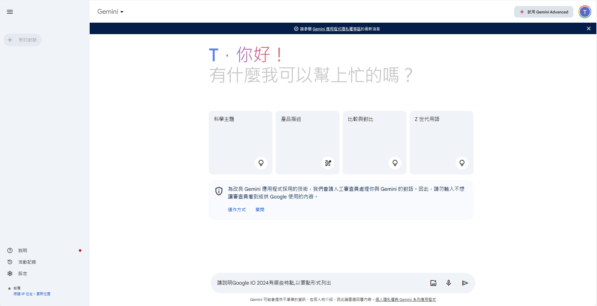
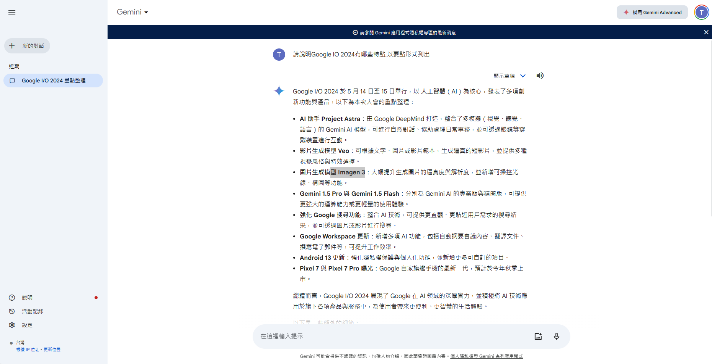
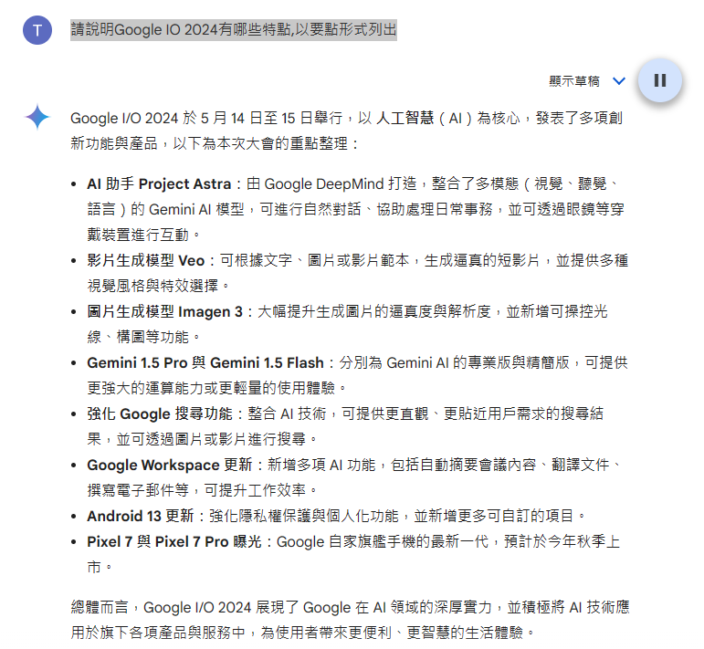

# Gemini


# 快速實戰
-`提問詞`: 請說明Google IO 2024有哪些特點,以要點形式列出
- `Gemini的回應`:
```

Google I/O 2024 於 5 月 14 日至 15 日舉行，以 人工智慧（AI）為核心，發表了多項創新功能與產品，以下為本次大會的重點整理：

AI 助手 Project Astra：由 Google DeepMind 打造，整合了多模態（視覺、聽覺、語言）的 Gemini AI 模型，可進行自然對話、協助處理日常事務，並可透過眼鏡等穿戴裝置進行互動。
影片生成模型 Veo：可根據文字、圖片或影片範本，生成逼真的短影片，並提供多種視覺風格與特效選擇。
圖片生成模型 Imagen 3：大幅提升生成圖片的逼真度與解析度，並新增可操控光線、構圖等功能。
Gemini 1.5 Pro 與 Gemini 1.5 Flash：分別為 Gemini AI 的專業版與精簡版，可提供更強大的運算能力或更輕量的使用體驗。
強化 Google 搜尋功能：整合 AI 技術，可提供更直觀、更貼近用戶需求的搜尋結果，並可透過圖片或影片進行搜尋。
Google Workspace 更新：新增多項 AI 功能，包括自動摘要會議內容、翻譯文件、撰寫電子郵件等，可提升工作效率。
Android 13 更新：強化隱私權保護與個人化功能，並新增更多可自訂的項目。
Pixel 7 與 Pixel 7 Pro 曝光：Google 自家旗艦手機的最新一代，預計於今年秋季上市。
```








