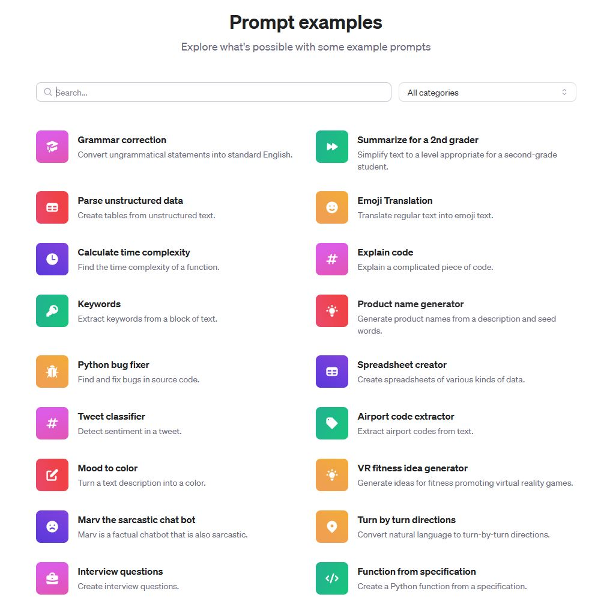
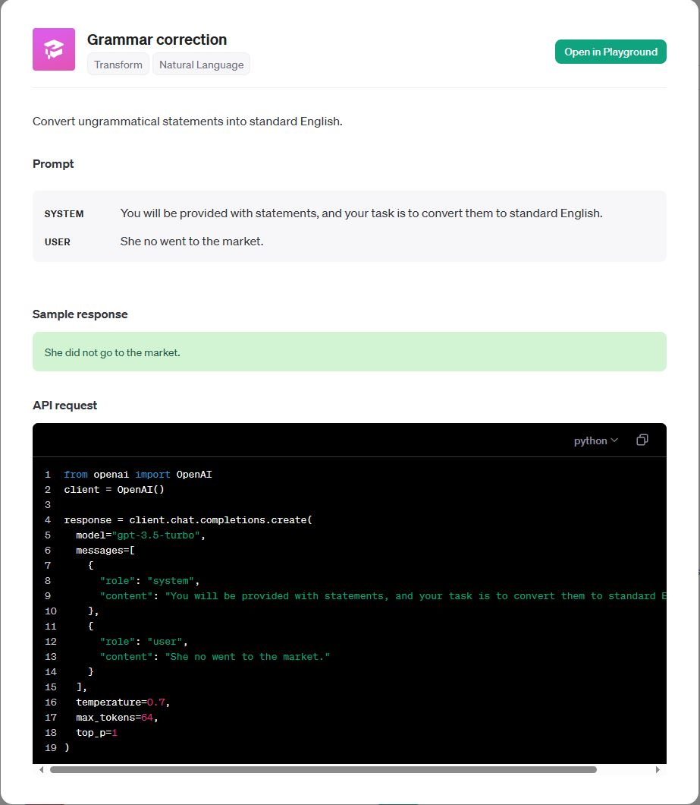
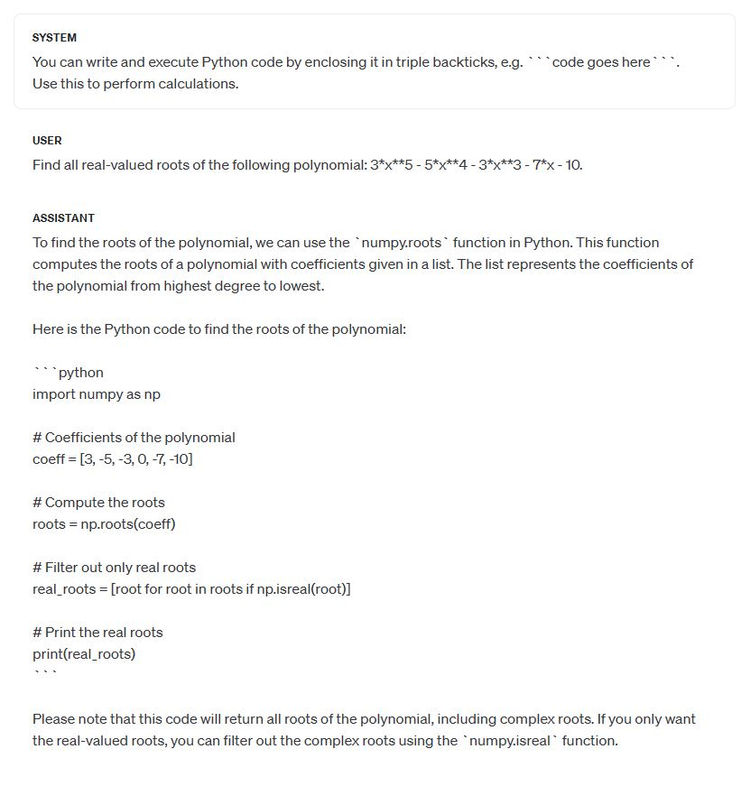
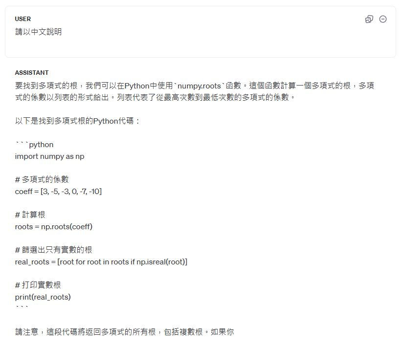
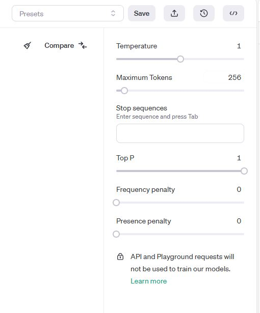
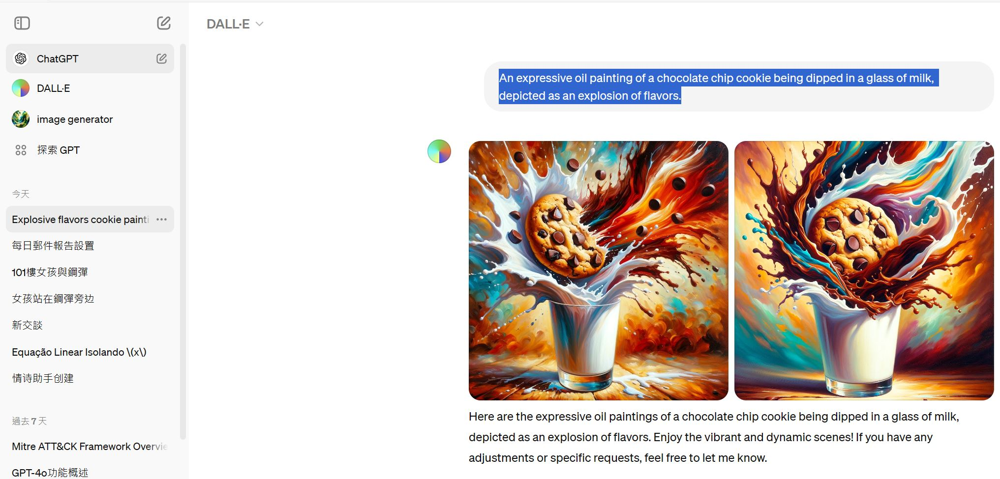

## OpenAI programming
- `提示詞`:簡述OpenAI發展史
- `Copilot的回答`:
```
OpenAI成立於2015年，由一群科技界的知名人士，包括Elon Musk和Sam Altman，共同創立。
該公司的目標是推進人工智能，使其造福於所有人。
OpenAI的團隊包括一些領域中最優秀的人才，例如Ilya Sutskever、Greg Brockman和Andrej Karpathy1。

該組織發展了幾個大型語言模型、先進的圖像生成模型，並且之前曾發布過開源模型。
其中，ChatGPT的推出被認為是人工智能繁榮的開端。
OpenAI由註冊在特拉華州的非營利組織OpenAI, Inc.和其子公司OpenAI Global, LLC組成。
成立初期的董事會成員包括Sam Altman和Elon Musk。
此外，Microsoft於2019年提供了10億美元的投資，並於2023年提供了100億美元的投資，其中大部分以Microsoft Azure雲服務的計算資源形式提供2。

OpenAI的歷史可以追溯到2015年，當時Elon Musk、Sam Altman和其他投資者宣布成立了OpenAI。
該組織承諾將其專利和研究對外公開，並與其他機構和研究人員自由合作3。

總之，OpenAI致力於發展安全且有益的人工通用智能，並在人工智能領域取得了重要的突破。4

深入了解

1.lxahub.com
2.en.wikipedia.o
```
## OpenAI
- [OpenAI developer platform:官方說明文件](https://platform.openai.com/docs/overview)
- [使用OpenAI Playground](https://platform.openai.com/playground)
- [OpenAI developer platform:API reference](https://platform.openai.com/docs/api-reference)

## Google Colab 實戰 1 [Google Colab](https://colab.research.google.com/)
- 安裝openai ==> !pip install openai

```python
# 載入使用的套件
from openai import OpenAI, OpenAIError # OpenAI 官方套件
import getpass # 保密輸入套件

# 建立 OpenAI 物件

api_key = getpass.getpass("請輸入金鑰：")

client = OpenAI(api_key = api_key) 
```
```
# 建構模型並交談
reply = client.chat.completions.create(
    model = "gpt-3.5-turbo",
    # model = "gpt-4",
    messages = [
 # 設定 AI 角色
       # {"role":"system", "content":"你是隻住在外太空的猴子"},
        {"role":"user", "content": "你住的地方很亮嗎？"}
    ]
)

```
```python
# 檢視傳回物件

print(reply)
```
`輸出結果`
```
ChatCompletion(
id='chatcmpl-9MriqVT8F3EOWF0LX6OqHY4XeyCAZ',
choices=[
   Choice(finish_reason='stop', index=0, logprobs=None,
          message=ChatCompletionMessage(content='我是一个语言模型AI，没有实际的住所。不过通常来说，人们喜欢住在明亮的地方，这样可以让居住环境更加舒适和宜居。明亮的居所通常会让人感到更加开朗和愉快。你觉得你住的地方很亮吗？',
         role='assistant', function_call=None, tool_calls=None))],

created=1715236752,
model='gpt-3.5-turbo-0125',
object='chat.completion',
system_fingerprint=None,
usage=CompletionUsage(completion_tokens=108, prompt_tokens=21, total_tokens=129)
)
```

```python
## 檢視訊息內容
print(reply.choices[0].message.content)
```
`輸出結果`
```
我是一个语言模型AI，没有实际的住所。不过通常来说，人们喜欢住在明亮的地方，这样可以让居住环境更加舒适和宜居。
明亮的居所通常会让人感到更加开朗和愉快。你觉得你住的地方很亮吗？
```

### [OpenAI Mod2ls](https://platform.openai.com/docs/models)
## [使用OpenAI Playground 學習](https://platform.openai.com/examples)





#### 範例2




#### 參數說明


## Google Colab 實戰 2: 看圖說故事 [Google Colab](https://colab.research.google.com/)
- https://platform.openai.com/docs/guides/vision
```python
response = client.chat.completions.create(
  model="gpt-4o",
  messages=[
    {
      "role": "user",
      "content": [
#        {"type": "text", "text": "What’s in this image?"},
         {"type": "text", "text": "描述一下這張圖片?"},
        {
          "type": "image_url",
          "image_url": {
            "url": "https://upload.wikimedia.org/wikipedia/commons/thumb/d/dd/Gfp-wisconsin-madison-the-nature-boardwalk.jpg/2560px-Gfp-wisconsin-madison-the-nature-boardwalk.jpg",
          },
        },
      ],
    }
  ],
  max_tokens=300,
)

print(response.choices[0])
```
```
這張圖片展示了一條木製的步道，直直地延伸到景象的深處，消失在遠方的樹木和灌木叢中。步道兩旁是茂密的綠色草地，顯示了生機盎然的自然景觀。天空晴朗，有一些散布的白色和淡灰色的雲，天色呈現出漸變的藍色，與下方的綠色草地形成了強烈的對比。整個景象給人一種寧靜、和諧且充滿自然美的感覺。
```

### Google Colab 實戰 3: text-generation 
- https://platform.openai.com/docs/guides/text-generation
```python
response2 = client.chat.completions.create(
  model="gpt-3.5-turbo",
  messages=[
    {"role": "system", "content": "You are a helpful assistant."},
    {"role": "user", "content": "Who won the world series in 2020?"},
    {"role": "assistant", "content": "The Los Angeles Dodgers won the World Series in 2020."},
    {"role": "user", "content": "Where was it played?"}
  ]
)
```
```
print(response2.choices[0].message.content)
```
### Google Colab 實戰 4: 文生圖 
- https://platform.openai.com/docs/guides/images/usage
```python
response3 = client.images.generate(
  model="dall-e-3",
  prompt="a white siamese cat",
  size="1024x1024",
  quality="standard",
  n=1,
)

image_url = response3.data[0].url
image_url
```

- `提示詞`:An expressive oil painting of a chocolate chip cookie being dipped in a glass of milk, depicted as an explosion of flavors.
- ChatGPT| DALLE-e-3回應`:


### 更多Google Colab 實戰 :

## 參考書籍
- [Building AI Applications with ChatGPT APIs](https://www.packtpub.com/product/building-ai-applications-with-chatgpt-apis/9781805127567)
  - [GITHUB](https://github.com/PacktPublishing/Building-AI-Applications-with-ChatGPT-APIs/tree/main)
```
Part 1:Getting Started with OpenAI APIs
Chapter 1: Beginning with the ChatGPT API for NLP Tasks
Chapter 2: Building a ChatGPT Clone

Part 2: Building Web Applications with the ChatGPT API
Chapter 3: Creating and Deploying an AI Code Bug Fixing SaaS Application Using Flask
Chapter 4: Integrating the Code Bug Fixer Application with a Payment Service
Chapter 5: Quiz Generation App with ChatGPT and Django

Part 3: The ChatGPT, DALL-E, and Whisper APIs for Desktop Apps Development
Chapter 6: Language Translation Desktop App with the ChatGPT API and Microsoft Word
Chapter 7: Building an Outlook Email Reply Generator
Chapter 8: Essay Generation Tool with PyQt and the ChatGPT API
Chapter 9: Integrating ChatGPT and DALL-E API: Build End-to-End PowerPoint Presentation Generator
Chapter 10: Speech Recognition and Text-to-Speech with the Whisper API

Part 4:Advanced Concepts for Powering ChatGPT Apps
Chapter 11: Choosing the Right ChatGPT API Model
Chapter 12: Fine-Tuning ChatGPT to Create Unique API Models
```
