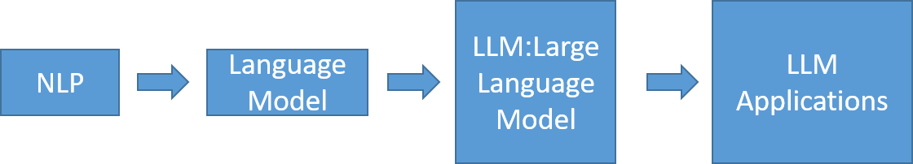

# GenAI Programming實戰
- LLM programming:OpenAI programming [OpenAI實戰](OpenAI.md)
- [GenAI | LLM 專案開發](DragonGPT.md)

# GenAI Programming

- [LLM | 大型語言模型 | Large Language Model](../LLM.md)

- LLM programming:OpenAI programming
- LLM programming:LangChain programming
  - [LangChain](LangChain.md)
  - [LangChain實戰1](LangChain_labs.md)
- 其他LLM Programming 
  - ChatGLM
    - ChatGLM-6B是中國大陸智譜AI研發的ChatGLM系列模型的新成員
    - ChatGLM-6B是一個開源的、支持中英雙語問答的對話語言模型，並針對中文進行了優化。
    - ChatGLM-6B基於General Language Model（GLM）架構，使用了和ChatGLM相同的技術，針對中文問答和對話進行優化。
    - 經過約1T token（標識符）量的中英雙語訓練，輔以監督微調、反饋自助、人類反饋強化學習等技術的加持，具有62億參數的它，降低推理成本和提升效率外，還能生成「相當符合人類偏好的回答」。
    - 此外，結合模型量化技術，可以稍為降低硬件門檻，使用者只需具有10GB（INT8）和 6GB（INT4）VRAM，便可以在消費級的顯示卡上使用該模型。
    - [新範式來臨 - 用 PyTorch 了解 LLM 開發微調 ChatGLM 全過程| 王曉華 著 | 深智數位(2024-04-19)](https://www.tenlong.com.tw/products/9786267383513?list_name=r-zh_tw)

