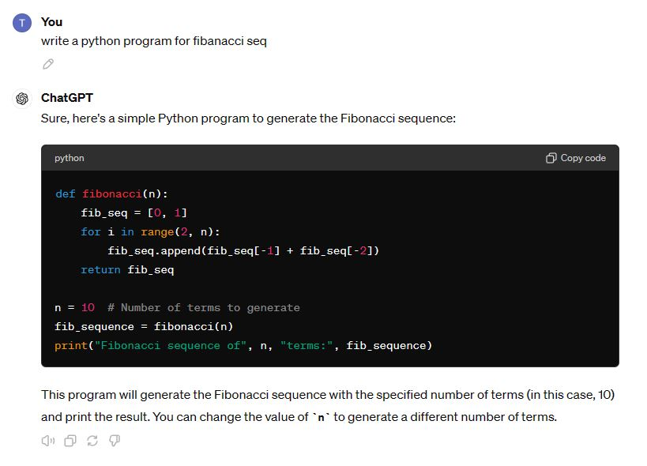
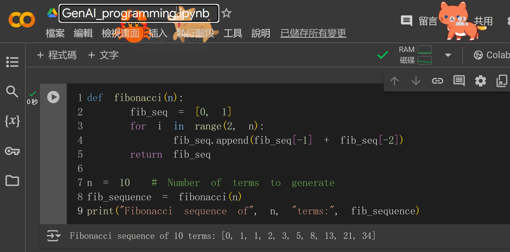

# GenAI Python
- 程式生成(Code Generation)
- 程式重構(Refactoring)
- 程式註解
  - 使用docstrings註解 
- 程式除錯(DEBUG)
- 程式翻譯(把Python程式轉換成C|C++|Java)

# AI 程式家教
- 哈佛大學CS50  [CS50.ai](https://cs50.ai/)
  - [CS50: Introduction to Computer Science](https://pll.harvard.edu/course/cs50-introduction-computer-science)
  - [CS50's Web Programming with Python and JavaScript](https://pll.harvard.edu/course/cs50s-web-programming-python-and-javascript)
  - [趨勢:CS50：一堂超過 800 個哈佛學生選修的「硬課」，魅力何在？](https://www.inside.com.tw/article/4209-harvard-cs50)
  - [哈佛大學 CS50 課程如何打造 AI 程式家教 CS50 ddb](https://www.explainthis.io/zh-hant/ai/CS50-ddb)

# Python 程式生成(Code Generation)
- `提問詞`:write a python program for fibanacci seq

- 使用 [Google Colab](https://colab.research.google.com/#) 跑跑看

 

# 更多Python 程式生成範例
- `提問詞`: 請使用python程式撰寫抓取YOUTUBE影片的音檔
- `提問詞`: 請使用python程式撰寫猜密碼程式
- `提問詞`: 請編寫二進位搜索(binary search)的python程式
- `提問詞`: 請編寫sequential search的python程式
- `提問詞`: 請編寫quick sort的python程式
- `提問詞`: 請使用python程式撰寫

# 程式註解

### 程式註解:請加上註解

### 程式註解:使用docstrings註解 

### 程式註解:請產生markdown 格式的說明文件

