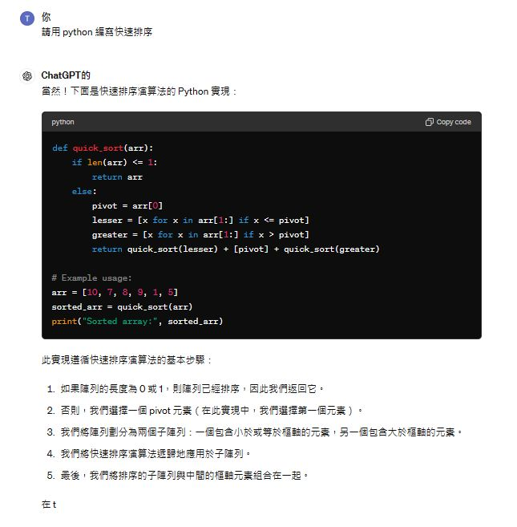
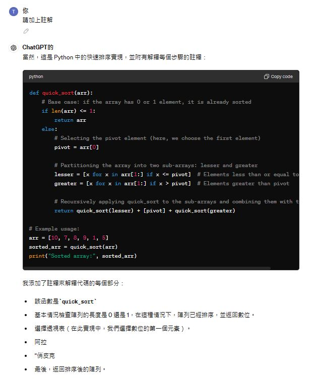
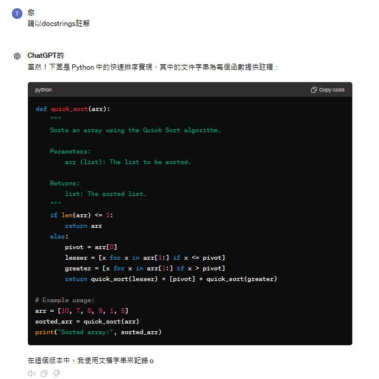
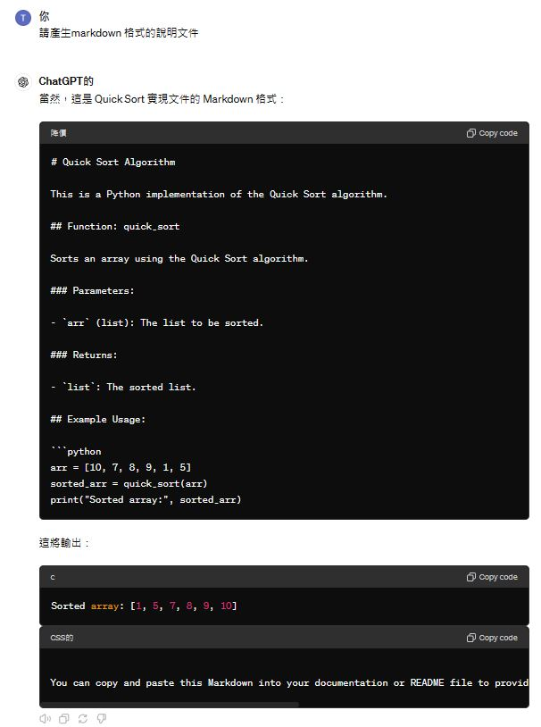

# GenAI Python
- 程式生成(Code Generation)
- 程式重構(Refactoring)
- 程式註解
  - 使用docstrings註解 
- 程式DEBUG
- 程式翻譯(把Python程式轉換成C|C++|Java)

# Python 程式生成
- `提問詞`:write a python program for fibanacci seq

- 使用 [Google Colab](https://colab.research.google.com/#) 跑跑看

 

# 更多Python 程式生成範例
- `提問詞`: 請使用python程式撰寫抓取YOUTUBE影片的音檔
- `提問詞`: 請使用python程式撰寫猜密碼程式
- `提問詞`: 請編寫二進位搜索(binary search)的python程式
- `提問詞`: 請編寫sequential search的python程式
- `提問詞`: 請編寫quick sort的python程式
- `提問詞`: 請使用python程式撰寫

# 程式註解

### 程式註解:請加上註解

### 程式註解:使用docstrings註解 

### 程式註解:請產生markdown 格式的說明文件

