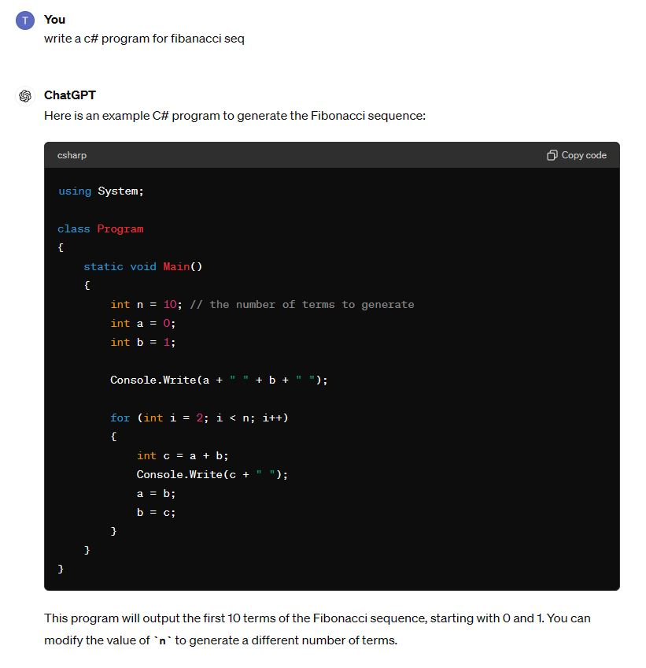

# 生成式AI(Generative AI)
- 讓電腦能夠模仿人類的創造力，產生出新的、原創的、有意義的內容。
- 2022-2023 ChatGP引領大流行
- 2024年5月13日重磅發行[GPT-4o(May 13, 2024)](GPT-4o.md)
- 特別是 輸入`文字` ==> 產生 AIGC (小說 | 圖片 | ......)
- AIGC == Artificial Intelligence Generated Content == 人工智慧產生的(小說 | 圖片 | ......) 

# 生成式AI(Generative AI)的理論 ==> 大學及研究所課程
- [LLM | Large Language Model|大型語言模型](LLM.md)
- 生成式AI(Generative AI)的模型1:VAE(Variational AutoEncoder)
  - 2013年 由與 Diederik P. Kingma提出
  - 論文[Auto-Encoding Variational Bayes](https://arxiv.org/pdf/1312.6114)
- 生成式AI(Generative AI)的模型2:生成對抗網路(GAN|Generative Adversarial Network)
  - 2014年 由 Goodfellow 所提出來的方法
  - 其結構由兩個網路所組成：生成器網路和鑑別器網路
  - 生成器網路負責生成以假亂真的合成樣本
  - 鑑別器網路負責仔細區分出真實樣本和合成樣本
  - 經由兩者交替對抗學習，最終我們可以得到一個好的生成器。
  - 這個生成器網路通常輸入為一組取樣自高斯分布的亂數，而輸出就是合成樣本。
- 生成式AI(Generative AI)的模型3:擴散模型(Diffusion Model)
  - [Stable Diffusion Online](https://stablediffusionweb.com/)
  - [中文版Stable Diffusion Online](https://stablediffusionweb.com/zh-tw/prompts)

# 生成式AI應用
- [70+生成式人工智能应用/使用案例](https://www.wbolt.com/generative-ai-applications.html)

- [awesome-ai-products](https://latentbox.com/zh/awesome-ai-products)
- [圖片生成(Image Generation)](AI_Image_Generation.md)
  - 技術
    - 文生圖(text to Image)
    - 圖生圖(Image to Image) 
  - 主題
    - LOGO設計
    - 人物設計
    - 海報設計
    - 黑膠(CD..)封面設計
      - [Lp Old Covers Masters](https://promptbase.com/prompt/lp-old-covers-masters) 
    - 建築設計
    - 室內設計
- 聲音生成(Voice Generation)
- 音樂生成(Music Generation)
- [影片生成(Video Generation)](AI_Video_Generation.md)
  - 短影音(YOUTUBE,...)生成
- 虛擬人物生成
# 各行各業的生成式AI應用
- 學生
  - 學習計劃書
  - 學習歷程
  - 自傳
  - AI 簡報
    - [4小時線上課程｜最具說服力簡報+高質感簡報生成教學｜獨家2合1智慧AI簡報術](https://event.gvm.com.tw/202405_gvmtechtalk/?utm_source=gvm&utm_medium=text_article2&utm_campaign=gvm_20240501_aippt&utm_content=_text_article2_middle) 
- 老師
  - 課程設計
  - 教學大綱
  - 教學內容
  - 考卷與評量
  - 成績分析 
- 程式師
  - [ChatGPT4程式師](AI4Programmer.md)
- 文學創作
  - 詩詞
  - 作詞
  - 小說
  - 劇本 
- 藝術創作
  - 各種商業設計 ==> LOGO 活動海報
  - AI藝術家 
- 影音創作
  - 作曲
  - 短影音生成
- 商業應用
  - 各種企劃案
  - 資料分析
