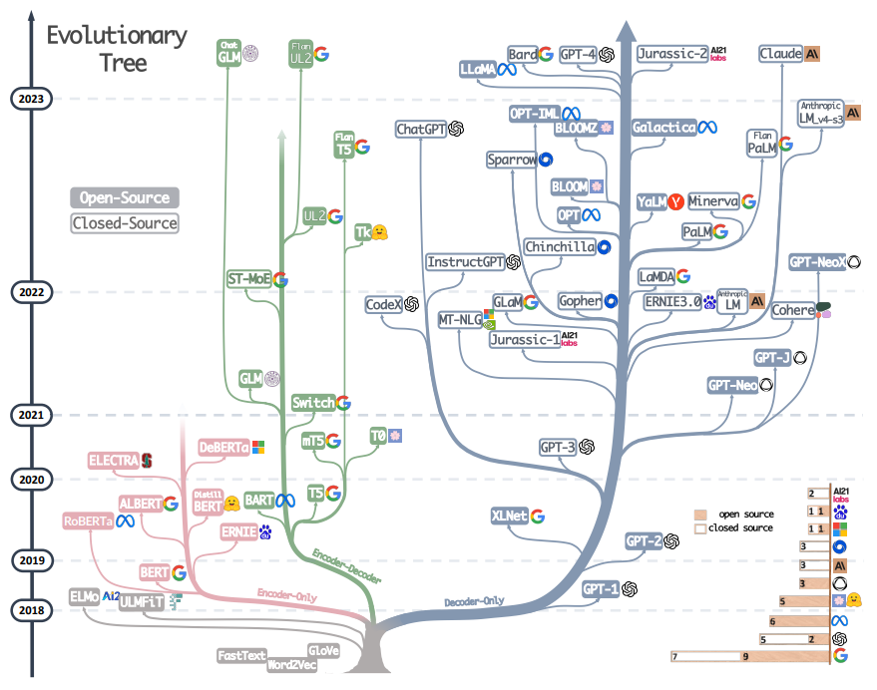

# LLM(Large Language Models)
- [LLM是什麼？跟AI的關聯為何？大型語言模型要面對什麼挑戰？一文看懂](https://www.bnext.com.tw/article/76864/what-is-the-meaning-of-llm)

## 故事爆發在2017 
.png)

## LLM發展史 Evolutionary Tree

- o	Open-Source
- o	Closed-Source
- o	Encoder-Only
- o	Encoder-Decoder
- o	Decoder- Only
### 2024
- Chat GLM(6B) [智譜清言-ChatGLM](https://chatglm.cn/)
  - [官方說明](https://github.com/THUDM/ChatGLM-6B)
  - ChatGLM-6B 是一個開源的、支持中英雙語的對話語言模型，基於 General Language Model (GLM) 架構，具有 62 億參數。
  - ChatGLM-6B結合模型量化技術，使用者可以在消費級的顯卡上進行本地部署（INT4 量化級別下最低只需 6GB 顯存）。
  - ChatGLM-6B 使用了和 ChatGPT 相似的技術，針對中文問答和對話進行了優化。
  - 經過約 1T 識別字的中英雙語訓練，輔以監督微調、回饋自助、人類回饋強化學習等技術的加持，62 億參數的 ChatGLM-6B 已經能生成相當符合人類偏好的回答。
  - chatglm.cn 體驗更大規模的 ChatGLM 模型。 
- Google Flan-UL2(20B)
- Meta LLaMA(65B)
  - LLaMA(Large Language Model Meta AI)是Meta AI公司於2023年2月推出的大型語言模型
  - 因其開源的特性與其擁有ChatGPT相似的效能，使得該模型受到許多人喜愛
  - 許多人會加以微調以達成預定的目的，甚至有許多人將這種模型視為「本地端ChatGPT」或「開源ChatGPT」
  - [ChatGPT的挑戰者LLaMA(上) - 目前最強大的開源語言模型LLaMA究竟做了什麼](https://ithelp.ithome.com.tw/articles/10338745)
  - [ChatGPT的挑戰者LLaMA(下) - 用RLHF與QLoRA調整大型語言模型](https://ithelp.ithome.com.tw/articles/10339382)
  - [How Does Llama-2 Compare to GPT-4/3.5 and Other AI Language Models](https://promptengineering.org/how-does-llama-2-compare-to-gpt-and-other-ai-language-models/)
- Google Bard|‎Gemini  [‎Gemini:獲取創意靈感，提升工作效率](https://gemini.google.com/?hl=zh-cn)
  - Bard AI 是由 Google 基於 LaMDA(Language Model for Dialogue Applications)所開發的 AI 聊天機器人
  - 它可以像搜尋引擎一樣回答簡單的問題，並對複雜的問題提供全面且優質的答案。
  - 2023年5月，Google宣布更改Bard底層模型，從LaMDA調整為PaLM 2，能力變得更強
  - Google Bard更名為‎Gemini
- 👍OpenAI GPT-4 
- Jurassic-2 
- Claude 3
  - 由OpenAI前成員建立的 Anthropic公司開發
  - 特色:(比ChatGPT厲害呢？)
    - 免費使用AI對話機器人
    - 資料更新到2023年初
    - 支援輸入100K token(詞語或字符的基本單位)的資料內容(GPT-4只有32K token)
    - 可以上傳PDF檔案取出文字和產生摘要

### 2023
- 👍ChatGPT(20B)
-	ST-MoE
-	UL2
  - 論文[UL2: Unifying Language Learning Paradigms](https://arxiv.org/abs/2205.05131)
-	Flan
-	T5
-	TK
- InstructGPT
- Sparrow
- OPT-IML
- BLOOMZ / BLOOM(176B)
- OPT
- Chinchilla
- Galactica 
- YaLM / PaLM(540B)
- Minerva
- LaMDA(173B)
- Flan PaLM
- Anthropic LM-v4-s3
- GPT-NeoX

### 2022
- GLM(General Language Model)
  - 論文[GLM: General Language Model Pretraining with Autoregressive Blank Infilling](https://arxiv.org/abs/2103.10360)
  - [官方GITHUB網址](https://github.com/THUDM/GLM)
- Switch 
- CodeX
- MT-NLG(530B)
- GLaM
- Jurassic-1
- Gopher
- ERNIE3.0
- LM
- Cohere
- GPT-J
- GPT-Neo

### 2021
- [Google ELECTRA](https://github.com/google-research/electra) 
- DeBERTa 
- mT5
- T0 
- GPT-3(175B)

### 2020
- RoBERTa
- ALBERT
- Distill BERT
- ERNIE 
- BART
- T5
- XL Net
- GPT-2

### 2019 BERT 元年 ==> 一堆 XXXBERT
- Google BERT(Bidirectional Encoder Representation from Transformers) 
- ELMo
- ULMFiT
- GPT-1

### 2017
- Google Transformer
  - [Transformer模型详解（图解最完整版）](https://zhuanlan.zhihu.com/p/338817680)

### 文字向量化
- FastText
  - https://fasttext.cc/
  - [fastText原理及实践 - 知乎]() 
- 史丹佛大學 的GloVe(2014)
  - [GloVe: Global Vectors for Word Representation](https://nlp.stanford.edu/projects/glove/)
  - [简介GloVe词向量：推导、实现、应用 - 知乎](https://zhuanlan.zhihu.com/p/101179171)
- word2Vec(2014)
  - Google 的一個開源工具，能夠根據輸入的「詞的集合」計算出詞與詞之間的距離

### Open-Source LLMs
- [The History of Open-Source LLMs: Better Base Models (Part Two)](https://cameronrwolfe.substack.com/p/the-history-of-open-source-llms-better)
