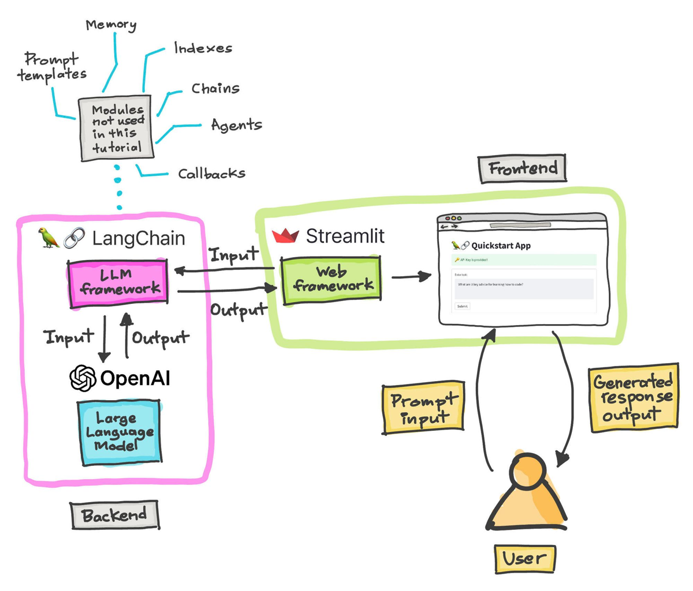

# LLM programming:LangChain 
  - [LangChain 實戰](LangChain_labs.md)

## 六大模組 [LangChain六大核心模块简要汇总](https://zhuanlan.zhihu.com/p/676719738)
- 一、Model I/O
- 二、Retrieval
- 三、Chains
  - Chain是LangChain中非常重要的元件，作用是管理應用程式中的資料流程動
  - 可以把不同元件（或者其他Chain元件）連結在一起，從而構建完整的資料處理流程。
- 四、Agents
- 五、Memory
  - LLM是無記憶的，在聊天機器人中，歷史消息是非常重要的，LangChain使用Memory元件來存儲歷史資訊
- 六、Callbacks

### 參考書籍 
- [LangChain 開發手冊 -- OpenAI × LCEL 表達式 × Agent 自動化流程 × RAG 擴展模型知識 × 圖形資料庫 × LangSmith 除錯工具 | 施威銘研究室](https://www.tenlong.com.tw/products/9789863127918?list_name=i-r-zh_tw)
- [LangChain 入門指南：構建高可復用、可擴展的 LLM 應用程序 | 李特麗,康軼文](https://www.tenlong.com.tw/products/9787121467271?list_name=srh)
  - [LLM 的瑞士刀 - 用 LangChain 極速開發可擴充大型應用程式](https://www.tenlong.com.tw/products/9786267383674?list_name=srh) 
- [LangChain 實戰：從原型到生產，動手打造 LLM 應用 |  張海立,曹士圯,郭祖龍]()
- [Building LLM Apps](https://www.packtpub.com/product/building-llm-apps/9781835462317)
- [Generative AI with LangChain](https://www.packtpub.com/product/generative-ai-with-langchain/9781835083468)
  - [GITHUB](https://github.com/benman1/generative_ai_with_langchain)
- [LangChain Masterclass - Build 15 OpenAI and LLAMA 2 LLM Apps Using Python [Video]](https://www.packtpub.com/product/langchain-masterclass-build-15-openai-and-llama-2-llm-apps-using-python-video/9781835464427)
- [The Complete LangChain & LLMs Guide [Video]](https://www.packtpub.com/product/the-complete-langchain-llms-guide-video/9781835885925)
- [DOCS](https://python.langchain.com/docs/get_started/introduction/)
